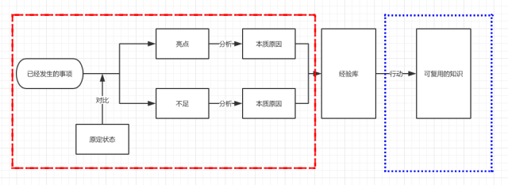
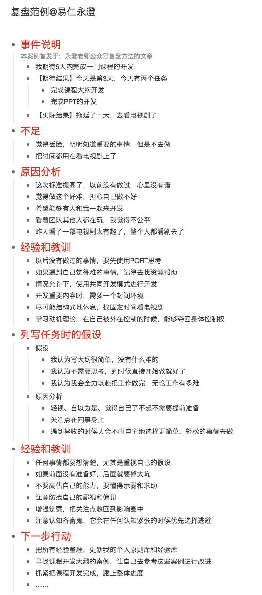

# 如何进行一次有效的复盘

## 总结/行动
* 每日总结中可以进一步增强对时间安排、目标达成的复盘。
* 项目结束后，或者阶段性产品研发结束后，对目标达成进行复盘
* 每次会议或者演讲结束后，对目标达成进行复盘
* 与人沟通时，提前预想达到的期望，事后进行复盘
* 而这所有的一切都有一个前提，预想目标。所以一定要有目标思维。

## 提纲/解释

* 复盘的定义
    * 复盘是一个利用“已经发生的事情”，通过“亮点和不足”分析“关键原因”，总结“经验教训”，最终使用“行动”将那些经验转化成可复用的（支持边际成本递减）的知识组块的过程。
    * 复盘是一个通过找到“假设”与“实际发生”之间的差距，分析假设有效性的一款工具。
* 底层逻辑
    * 复盘的目的是对假设进行校验。
    * 复盘是将“最终产生的现实成果”和基于“原有前提假设”的“期待成果”进行比对，通过对比的差距来判断自己“原有前提假设”哪里有问题，并对其进行修改和调整的一种方法。
* 重要性
    * 复盘就是不断调整自己对这个复杂的现实世界认知的过程。
    * 通过复盘，我们可以获得对于某件事的经验，提高对某件事的认知水平。
    * 用一个公式来说明：输入*生产系统=输出。复盘就是不断提升生产系统的过程。
* 复盘方法
    * 事件说明：包括期待结果与实际结果
    * 亮点或不足：从感受层面，我认为哪里好哪里不好
    * 原因分析：分析亮点或不足的原因
    * 经验和教训：基于原因，总结经验和教训，得到若干个可以在未来使用的防范风险的经验
    * 列写任务时的假设：思考自己做出期待结果的假设，并分析假设存在的问题
    * 经验和教训：调整自己的假设，提高对事物的认知。
    * 下一步行动：基于以上的复盘，下一步要做什么。

    
## 笔记/事实

### 重要性

* 复盘是一座金山。复盘很重要。
* 为什么复盘这么重要，但是自己却不去用、不去学？
    * 复盘之所以难以掌握的第一个原因是：复盘入门容易、进阶难。在进阶的过程中，因为各种原因导致平台期过长、反馈慢，就很容易放弃。
        * 时间管理和复盘，到底哪个重要？
            * 长周期的视角下，时间管理根本就是一个小技能罢了，而复盘却是一个可以一生精进的重要能力。
            * 时间管理的主要目的是为了把杂乱无章理清楚，不断提高绩效；而复盘是把最重要的东西找到，全力投入一件事来获得超额回报。
            * 复盘的目的是做对的事（选择），而时间管理的目的是把事情做对（努力），选择大于努力啊，明显复盘对于人的一生来说是更重要的啊！
        * 教育界都熟知一个农民模型：FARMER，这个模型指的是成年人学习的一些特点：
            * 易忘的、容易对抗、目标导向、期待被激励、经验主义、需要重复回顾。
            * 如果和自己的经验不相符、短期内没有收到回报，自己就特别容易产生对抗。
            * 复盘，恰好就是这样的：它需要不断自我挑战、短期内需要投入大量成本、期待产生复利回报还必须掌握一些封装方法。
    * 复盘之所以难易掌握的第二个原因：复盘这种能力的重要性，必须要在能够理解“假设校验”、“经验封装”等概念之后，才能爆发巨大的力量，而这些价值只有在突破平台期之后才能亲身体验到。
        * “投入一点点，就一辈子受益”，这句话就是边际成本递减的概念。复盘恰好是符合边际成本递减的一种能力，投入一两年左右的持续学习和训练，就可以一生受益。
* 复盘的基本套路：
    * 罗列目的和目标。也就是说你做这件事情的出发点，以及期待达到的样子；
    * 分析亮点和不足。事情已经完成了，自己感觉哪里做得好、哪里不好呢？好不好都是以目的目标为参照物的。
    * 分析关键原因。找出亮点不足并不是目的，而只是一种手段，是帮助分析背后关键原因的方式。我在情绪调整类的文章中谈到过类似的信念：情绪是发现问题的钥匙，我们之所以要用感受描述亮点和不足，就是要不断分析原因。（这里特别说一句，分析关键原因，本质上是从现实世界回到真实世界的路，如果你认同我的三观体系，那这是必须要一直分析到本质原因上去的。）
    * 找出经验和行动。从过往的亮点不足、原因分析中要形成经验，这个经验用来面对未来的各种可能，只有梳理出经验，才是金山中的价值。只有经验还是不够的，有很多经验都是认知，必须通过行动转化形成更通用性的知识、框架、概念、模型、方法论、流程、标准、清单等已经被封装好的知识，这样便于在未来调用使用。
* 复盘的定义：
    * 复盘是一个利用“已经发生的事情”，通过“亮点和不足”分析“关键原因”，总结“经验教训”，最终使用“行动”将那些经验转化成可复用的（支持边际成本递减）的知识组块的过程。
        
    * 红色框所表示的是“假设校验”的具体做法。复盘是一个通过找到“假设”与“实际发生”之间的差距，分析假设有效性的一款工具。
    * 蓝色框所表示的是“知识封装”的简单流程。
    * 复盘是极其前置的、促进成长的抓手能力
    * 复盘的目的是对假设进行校验。

### 底层逻辑

* 复盘和反思的区别是什么？
    * 复盘和反思，都是假设校验的一种有效工具；
    * 复盘，联想集团的若干HR将其做成培训课程，也写了书，比如说《复盘》、《复盘+》等，有它基本的固定套路；而反思，就是大家通常的叫法，做法更加灵活；
    * 如果简单粗暴的说，你也可以认为复盘 = 反思，这就是区别，基本上也没有啥区别。
    * 复盘和反思都是对假设进行校验的工具，不过，复盘更多应用在以事情为导向的场景，比如说对某一件事/某个项目/某个目标进行复盘；而反思更多用在以时间、思维模式、行为模式为导向的场景，比如说反思一下今天、反思一下是否做到了积极主动等。虽然，在细微上有差异，但是在实践上可以混用，因为，它们本来就是一个目的——假设校验，它们的原理和方法都很相似。
* 复盘的目的是对假设进行校验。
    * 什么是假设
        * 某人认为做了“某些事项”就可以得到自己想要的“结果”
        * 做“某些事项”就可以得到“结果”，这个对应关系是基于什么原因（逻辑、假设）而建立的？
        * 来举个例子加深理解：“我现在很饿，我想去吃碗面条。”这是我们通常的句式，也可以按照图片的模式将这个句式改成：“我认为吃碗面条，可以让自己不饿。”
    * 我们通过一个句式，可以找到假设，这个话术是：“通过做XX事项，可以得到XX结果，那么做XX事项就得到XX结果的假设是什么呢？”
    * 什么是假设校验
        * 我们一开始确实有假设，可以得到“期待结果”，但是实际做的时候，很可能得到的并不是期待的结果，而是“实际结果”。这时，“实际结果”和“期待结果”之间的差距，原因就是假设出了问题，于是，就可以根据“实际结果”和“期待结果”的差距来校验假设到底哪里出问题了，这就是假设校验。
* 复盘的底层逻辑：复盘是将“最终产生的现实成果”和基于“原有前提假设”的“期待成果”进行比对，通过对比的差距来判断自己“原有前提假设”哪里有问题，并对其进行修改和调整的一种方法。
    * 在做任何事情之前，我们都会对要做的事情与要实现的目标之间的关联性进行假设，无论这个假设你是否察觉到，假设都是存在的；
    * 即便如此，我们也并不见得一定推导得出做某事的假设；
    * 如果不知道假设是什么，那就用实践的方式去验证、去判断；
    * 如果你想要的结果和现实之间不同，那肯定是存在问题，而这个问题就可以帮助自己找出不同结果背后的“假设”；
    * 假设有了，再结合实际情况，不断校验、优化假设。
    
### 实践

* 案例分析：
    * 小G设定了一个目标：小明希望明天去公园玩。
    * 基于某假设，小G认为自己可以达成目标/完成任务/取得成果等。
        * 他期待实现这个场景/画面的假设是：他认为明天天气好，去玩应该心情不错；他认为去公园有助于放松工作的压力。无论他怎么认为，这些事情当下都没有发生，都只是他的假设而已。
    * 实际结果：第二天到了，小G真的去公园玩了，可能会出现一些完全不同的结果。
        * 根据小G的感受不同，我们将他的满意度分成三个区域，不足区域、亮点区域、未感知区域。这个界限的划分，是以自己感受为标准的，自己感受到了不满意，就是不足，自己感受到了满意，就是亮点。未感知区域的状态，我们就定义为会按照“原有假设”的样子发生，我们将其称之为“期待结果”。
        * 期待结果：按照原有假设发生的结果，这个结果可能和原有假设所得到的那副画面略有出入，但是自己也不太在意那些区别。
        * 实际结果：通常的实际结果会有两种不同，一种是让自己觉得不满的“不足”，一种是让自己觉得满意的“亮点”。
    * 关键：实际结果和期待结果之间出现了差距。
        * 实际结果和期待结果之间的差距，究竟是什么原因导致的呢
        * 看看自己的期待和实际中的差别，主要体现在两点：
            * 结果差别：原来预期的是一副画面，而实际上有多种可能性；
            * 系统差别：原来产生预期的系统是假设，是自己的思考，而实际上是经历了“现实”这个复杂系统。
        * 导致结果不同的原因是：系统差异。
    * 问题：我们的假设可能与现实是不一样的。那我们就需要不断调整自己的假设，让它和现实保持一致，或者无限接近一致。最重要的就是不断对假设进行校验。
* 那如何做到对假设进行校验呢？我们用的方法是：用差异倒推原因的方法。也就是说：
    * 首先，先把“期待结果”和“实际结果”进行对比，找出之间的差异，尤其是那些触发自己感受的亮点和不足；
    * 其次，分析这些“亮点”和“不足”产生的原因是什么？
    * 最后，分析“假设”和“现实”之间的差距，并将“假设”进行调整。
    * 示例：
        * 实际结果：小G到公园，忽然天下了大雨，把他淋湿了。
        * 不足：天竟然下雨把自己弄湿了，游玩泡汤了！自己不仅没有放松心情，还特别不爽。
        * 不足原因：分析一下，之所以会这样，就是因为小G没有看天气预报；不爽的原因是没有玩成，所以不爽。
        * 假设校验：第一个假设是：自己以为天气很好，但是发现现实状况根本不按照自己想的去发展；第二个假设是：自己以为去公园就能放松，但是，发现达不到自己的预期就不会给心情放假。
    * 复盘过程：
        * 先陈述自己的目的和目标。因为你要知道，一切都是围绕着它们做的；
        * 再罗列亮点和不足的感受。亮点和不足，只和你的感受有关，只需要表达你认为哪里好、哪里不好即可，不需要分析原因；
        * 其次，根据每一个亮点/不足，去探求是什么造成了这个亮点、不足的出现，找出导致差异的原因；
        * 最后，梳理经验和教训，通过不断分析亮点和不足的原因，自己可以得到若干可以用在未来的、防范未来风险发生的经验。
* 复盘模板：
    * 事件说明
    * 不足
    * 原因分析
    * 经验和教训
    * 列写任务时的假设
    * 经验和教训
    * 下一步行动
* 案例：
    

## 参考资料
1. [永澄：一座金山摆在眼前却不冲上去，究竟是啥原因？](https://mp.weixin.qq.com/s?__biz=MzIzOTY0OTA3OA==&mid=2247484929&idx=1&sn=ed285aced38ee0a72b049241a48012d2&chksm=e927ae58de50274e11709d5386fd6540d4dbb111bbf42b4f45dd6ad15bd0a1d7b4121da53983&scene=21#wechat_redirect)
2. [永澄：复盘的底层逻辑都不掌握，怎么可能学会？](https://mp.weixin.qq.com/s?__biz=MzIzOTY0OTA3OA==&mid=2247484964&idx=1&sn=673748adb401494fdfd066fc00db8709&chksm=e927ae7dde50276b0ab23e70e4db35e906fd6ee5311b9061428fafb0e364f7b0794b738d5f15&scene=21#wechat_redirect)
3. [永澄：如何用复盘进行假设校验？](https://mp.weixin.qq.com/s?__biz=MzIzOTY0OTA3OA==&mid=2247484996&idx=1&sn=4288da081e01d657b1bac4ad28819fd0&chksm=e927ae1dde50270bd6007bd7c5118c0dfd67f69b356833411ac82e352b4e382347e092f23ab0&scene=21#wechat_redirect)

## ChangeLog

* 20181120 | 创建文章