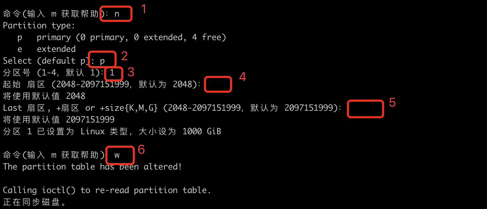
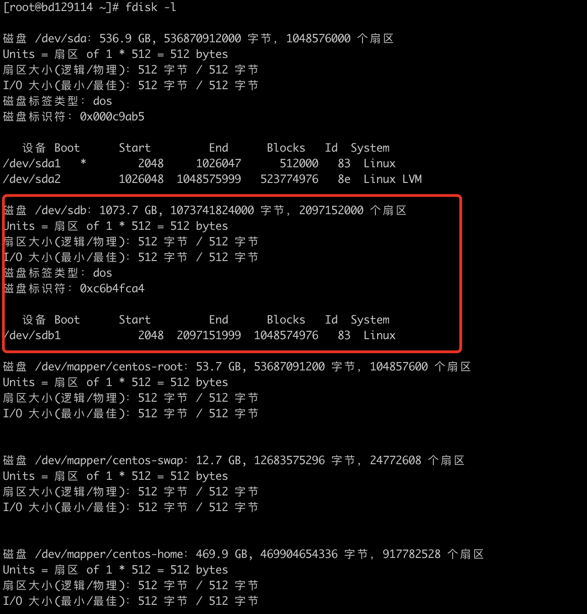

# 为Linux虚拟机磁盘

## 在Vmware中操作增加一个磁盘
略
## 对新磁盘进行分区
### 查看系统分区的详细情况

```Shell
[root@bd129114 ~]# fdisk -l

磁盘 /dev/sda：536.9 GB, 536870912000 字节，1048576000 个扇区
Units = 扇区 of 1 * 512 = 512 bytes
扇区大小(逻辑/物理)：512 字节 / 512 字节
I/O 大小(最小/最佳)：512 字节 / 512 字节
磁盘标签类型：dos
磁盘标识符：0x000c9ab5

   设备 Boot      Start         End      Blocks   Id  System
/dev/sda1   *        2048     1026047      512000   83  Linux
/dev/sda2         1026048  1048575999   523774976   8e  Linux LVM

磁盘 /dev/sdb：1073.7 GB, 1073741824000 字节，2097152000 个扇区
Units = 扇区 of 1 * 512 = 512 bytes
扇区大小(逻辑/物理)：512 字节 / 512 字节
I/O 大小(最小/最佳)：512 字节 / 512 字节


磁盘 /dev/mapper/centos-root：53.7 GB, 53687091200 字节，104857600 个扇区
Units = 扇区 of 1 * 512 = 512 bytes
扇区大小(逻辑/物理)：512 字节 / 512 字节
I/O 大小(最小/最佳)：512 字节 / 512 字节


磁盘 /dev/mapper/centos-swap：12.7 GB, 12683575296 字节，24772608 个扇区
Units = 扇区 of 1 * 512 = 512 bytes
扇区大小(逻辑/物理)：512 字节 / 512 字节
I/O 大小(最小/最佳)：512 字节 / 512 字节


磁盘 /dev/mapper/centos-home：469.9 GB, 469904654336 字节，917782528 个扇区
Units = 扇区 of 1 * 512 = 512 bytes
扇区大小(逻辑/物理)：512 字节 / 512 字节
I/O 大小(最小/最佳)：512 字节 / 512 字节
```

可以发现`/dev/sdb`是新增的磁盘，还没有分区。

### 对新的磁盘进行分区

#### 进入分区模式

```shell
[root@bd129114 ~]# fdisk /dev/sdb
欢迎使用 fdisk (util-linux 2.23.2)。

更改将停留在内存中，直到您决定将更改写入磁盘。
使用写入命令前请三思。

Device does not contain a recognized partition table
使用磁盘标识符 0xc6b4fca4 创建新的 DOS 磁盘标签。

命令(输入 m 获取帮助)：m
```

#### 输入m进入帮助

```
命令(输入 m 获取帮助)：m
命令操作
   a   toggle a bootable flag
   b   edit bsd disklabel
   c   toggle the dos compatibility flag
   d   delete a partition
   g   create a new empty GPT partition table
   G   create an IRIX (SGI) partition table
   l   list known partition types
   m   print this menu
   n   add a new partition
   o   create a new empty DOS partition table
   p   print the partition table
   q   quit without saving changes
   s   create a new empty Sun disklabel
   t   change a partition's system id
   u   change display/entry units
   v   verify the partition table
   w   write table to disk and exit
   x   extra functionality (experts only)

命令(输入 m 获取帮助)：
```

#### 增加一个新的分区

```
命令(输入 m 获取帮助)：n
Partition type:
   p   primary (0 primary, 0 extended, 4 free)
   e   extended
Select (default p): p
分区号 (1-4，默认 1)：1
起始 扇区 (2048-2097151999，默认为 2048)：
将使用默认值 2048
Last 扇区, +扇区 or +size{K,M,G} (2048-2097151999，默认为 2097151999)：
将使用默认值 2097151999
分区 1 已设置为 Linux 类型，大小设为 1000 GiB
```



### 查看是否分区成功



## 在CentOS中挂载新分区

### 对新分区进行格式化

```shell
[root@bd129114 ~]# mkfs -t ext3 /dev/sdb1
mke2fs 1.42.9 (28-Dec-2013)
文件系统标签=
OS type: Linux
块大小=4096 (log=2)
分块大小=4096 (log=2)
Stride=0 blocks, Stripe width=0 blocks
65536000 inodes, 262143744 blocks
13107187 blocks (5.00%) reserved for the super user
第一个数据块=0
Maximum filesystem blocks=4294967296
8000 block groups
32768 blocks per group, 32768 fragments per group
8192 inodes per group
Superblock backups stored on blocks:
	32768, 98304, 163840, 229376, 294912, 819200, 884736, 1605632, 2654208,
	4096000, 7962624, 11239424, 20480000, 23887872, 71663616, 78675968,
	102400000, 214990848

Allocating group tables: 完成
正在写入inode表: 完成
Creating journal (32768 blocks): 完成
Writing superblocks and filesystem accounting information: 完成
```

### 挂载新分区

```Shell
[root@bd129114 /]# mkdir /data
[root@bd129114 /]# mount /dev/sdb1 /data
# 取消挂载
# umount /dev/sdb1 /data
```

### 查看分区挂载情况

```Shell
[root@bd129114 /]# df -h
文件系统                 容量  已用  可用 已用% 挂载点
/dev/mapper/centos-root   50G  4.1G   46G    9% /
devtmpfs                  12G     0   12G    0% /dev
tmpfs                     12G     0   12G    0% /dev/shm
tmpfs                     12G  8.6M   12G    1% /run
tmpfs                     12G     0   12G    0% /sys/fs/cgroup
/dev/mapper/centos-home  438G   33M  438G    1% /home
/dev/sda1                497M  125M  372M   26% /boot
tmpfs                    2.4G     0  2.4G    0% /run/user/0
/dev/sdb1                985G   72M  935G    1% /data
```

### 开机自动挂载

```Shell
[root@bd129114 /]# vi /etc/rc.d/rc.local
# 在文件末尾增加：
mount /dev/sdb1 /data
```


## 参考资料

1. [Linux虚拟机下如何添加新磁盘 - l\_liangkk的博客 - CSDN博客][1]

## ChangeLog

* 20190902 | 创建文档

[1]:	https://blog.csdn.net/l_liangkk/article/details/81268938