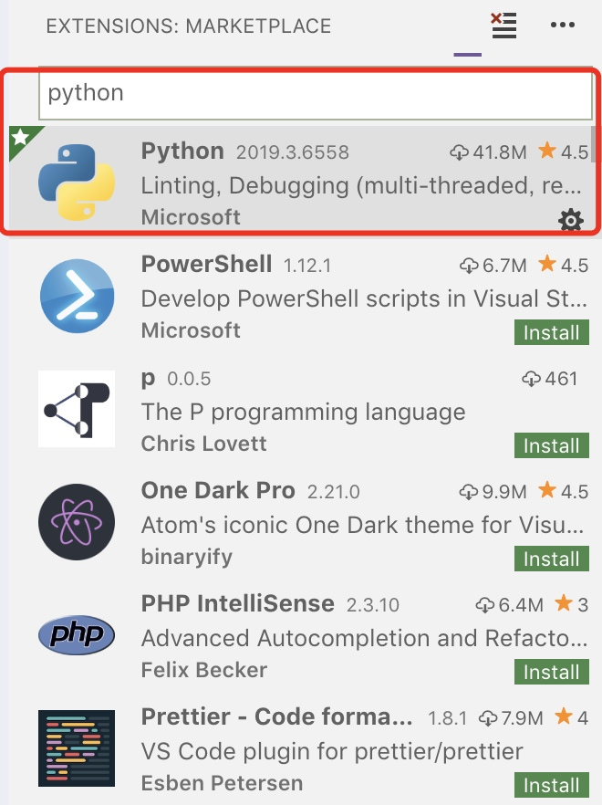
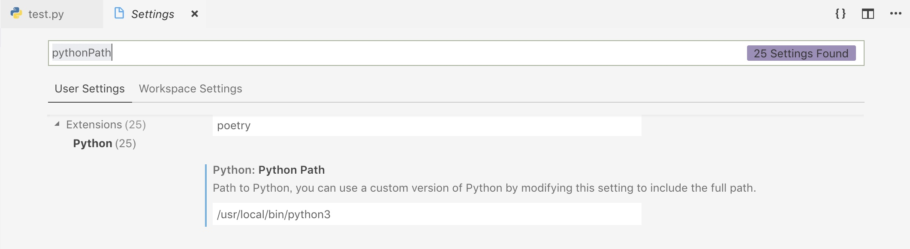
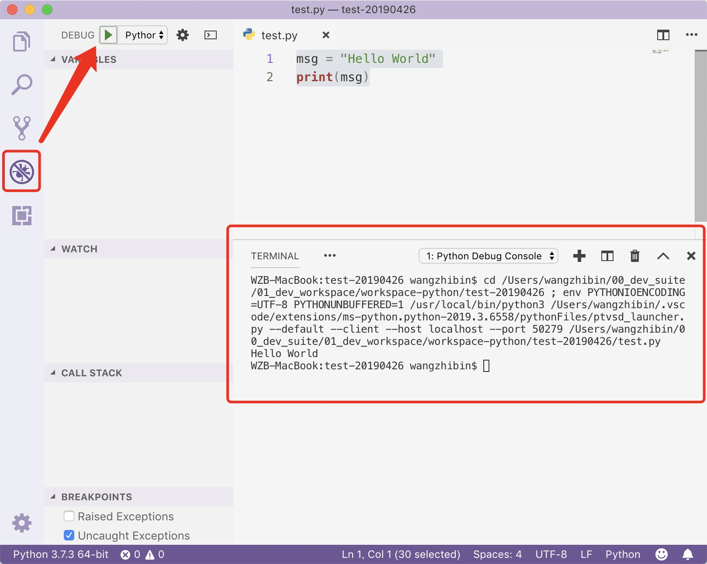

# 2019-04-26 | Mac OS搭建Python开发环境

> 2019-04-26

## 安装Python
> 参考：https://www.jianshu.com/p/892a14bdda4d
> https://blog.csdn.net/tymatlab/article/details/78609861
> https://github.com/Homebrew/homebrew-core/issues/19286

1. Brew方式安装：
    ```
    $ brew install python3
    Warning: python 3.7.3 is already installed, it's just not linked
    You can use `brew link python` to link this version.
    ```
    
2. 问题：发现/usr/local/下没有路径/usr/local/Frameworks。需要新建该路径，并修改权限
    ```
    $ brew install python3
    Error: An unexpected error occurred during the `brew link` step
    The formula built, but is not symlinked into /usr/local
    Permission denied @ dir_s_mkdir - /usr/local/Frameworks
    Error: Permission denied @ dir_s_mkdir - /usr/local/Frameworks
    ```
    解决：
    
    ```
    $ sudo mkdir /usr/local/Frameworks
    $ sudo chown $(whoami):admin /usr/local/Frameworks
    ```
    
1. brew link python3
    ```
    $ brew link python3
    Linking /usr/local/Cellar/python/3.7.3... 20 symlinks created
    ```
    
2. which python3
    ```
    $ which python3
    /usr/local/bin/python3
    ```
    
1. 一个非常重要的问题
> 来源：https://www.jianshu.com/p/892a14bdda4d

    Mac OS自身其实已经带有Python，版本为2.7.X，这个Python主要用于支持系统文件和XCode，所以我们在安装新的Python版本时候最好不要影响这部分。
    
    这里就会出现一个十分困扰的问题，我们按照上述步骤安装好了自己所需要Python版本，目前我们一般都会选择安装Python 3.X版本，在安装好了之后，我们输入以下命令
    
    `python --version`或者`python`
    
    发现所示内容仍然是2.7.X版本的Python，这是因为我们使用python这个命令，系统仍然会调用默认的Python版本(即系统版本)，网上很多教程会让我们修改配置文件或者$PATH变量将系统默认Python版本切换至我们安装的版本，但是个人感觉没有多大必要，毕竟系统的东西能不改最好不要改。
    
    所以我们选择一个比较简单的办法，就是当我们需要使用自己安装的Python版本时(即之前安装的3.X版本)，直接使用python3作为命令即可。相同的命令为：
    
    终端输入以下命令，查看Python安装位置`which python3`，终端输入以下命令，查看Python当前版本`python3 --version`，终端输入以下命令，进入Python交互模式`python3`
    
    
## 安装pip3
>参考：https://oldtang.com/351.html
>https://pip.readthedocs.io/en/stable/installing/

* 如果通过 homebrew 安装 python3，那么 pip3 会同时安装。所以建议直接通过 homebrew 安装 python3：
    ```
    brew install python3
    ```
    
* 如果你已经通过其他渠道安装了 python3 但是尚未安装 pip3，那么需要通过以下步骤实现安装：
    ```
    curl https://bootstrap.pypa.io/get-pip.py -o get-pip.py
    python3 get-pip.py
    cd cd /usr/local/bin/
    ln -s ../Cellar/python/3.7.3/Frameworks/Python.framework/Versions/3.7/bin/pip3 pip3
    ```
    
* 安装完成后，可以查看一下 pip3 的版本：
    ```
    pip3 -V
    ```
    
* 使用 pip3 安装第三方库
    这个就很简单了，直接使用 pip3 install 就行了，比如：
    ```
    pip3 install flask
    ```
    
    自己想装什么就装什么即可。
    
    
## Mac中Python开发IDE环境搭建
> 参考：https://blog.csdn.net/a464057216/article/details/55652179
> https://www.readern.com/configure-vscode-for-python3-on-mac.html

1. 安装Vscode
    略
2. 下载Python插件
    
3. 配置PythonPath
    
4. 新建Python文件test.py
    
    ```
    msg = "Hello World"
    print(msg)
    ```  
5. 执行python脚本
    

## 学习资料
1. 《机器学习从认知到实践》源码：https://github.com/PacktPublishing/Python-Machine-Learning-Blueprints

