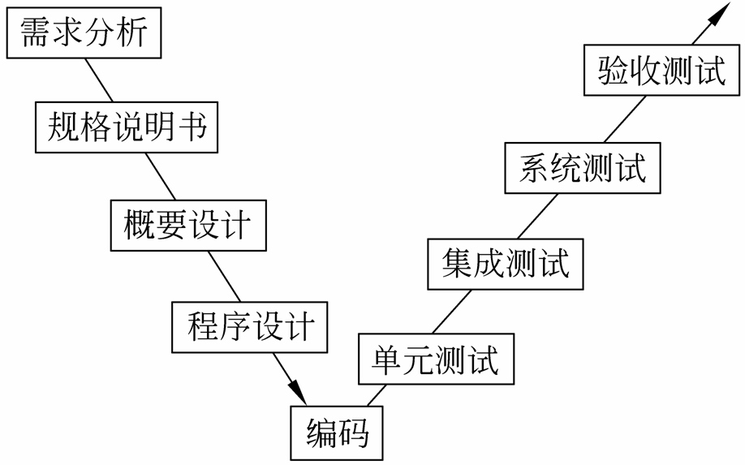
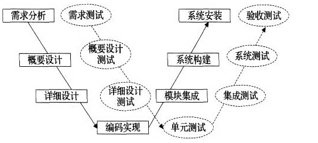
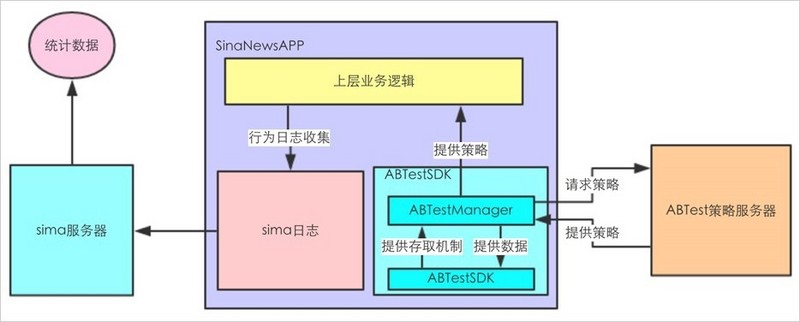

# 测试基本知识

## 软件测试基础知识点
1. 软件测试阶段：单元测试-->集成测试-->系统测试-->验收测试
2. 软件测试按测试手段可分为：黑盒测试、白盒测试、灰盒测试；手工测试、自动化测试；静态测试、动态测试。
    * 黑盒测试：把软件当做是一个黑盒子来进行测试，在测试的过程中，不需要关心内部结构是什么样的，怎么实现的，只需要按照需求规格说明书，检查程序的功能是否符合功能说明。黑盒测试又叫功能测试或数据驱动测试。
    * 白盒测试：需要对软件的内部实现进行细致的检查。测试人员需要根据程序内部的逻辑结构，设计测试用例，对所有逻辑路径进行测试。白盒测试又称为结构测试或逻辑驱动测试
    * 灰盒测试：关注输入与输出的正确性，也关注内部实现。但是没有白盒测试那么详细，只针对关键性的事件和标识来判断内部的运行状态。常见的灰盒测试是对各个模块之间的交互进行测试验证。
    * 参考：
        * https://blog.csdn.net/bwf_shwangzhanbu/article/details/85007007
        * https://blog.csdn.net/qq_22313585/article/details/79066523
3. 软件测试按测试模式可分为：V模型、W模型【常用的模型】
    * 参考资料：https://blog.csdn.net/qq_40927789/article/details/82560100
    * V模型
        * 

    * W模型
        * 
4. 软件测试按照测试类型可分为：功能测试、性能测试、安全测试、兼容性测试、文档测试
5. 其他软件测试类型可分为：回归测试、monkey测试、冒烟测试、A/B测试
6. 在功能测试中主要针对的是功能错误或遗漏、界面问题、性能错误【软件本身的性能问题】、数据及访问错误、初始化及终止错误
7. 在功能测试中可以用到的工具有：QTP、selenium、watir等等

解释：
1. 单元测试：主要是由开发人员自己进行的测试，测试人员一般不会参与单元测试
2. 集成测试：是在单元测试的基础上，测试在将所有的软件单元按照概要设计规格说明的要求组装成模块、子系统或系统的过程中各个部分工作是否达到或实现相应技术指标及要求的活动
3. 系统测试：将经过集成测试的软件，作为计算机系统的一部分，与系统中其他部分结合起来，在实际运行环境下对计算机系统图进行的一系列的严格有效的测试，以发现如潜在的问题，保证系统的正常运行
4. 验收测试：也称交付测试。针对用户需求、业务流程的正式的测试，确认系统是否满足验收标准，由用户、客户或其他机构决定是否接受系统
5. 功能测试：根据产品特性、操作描述和用户方案，测试一个产品的特性和可操作行为以确定他们满足设计需求
6. 性能测试：包含负载测试、压力测试、稳定性测试等
7. 安全测试：对软件产品进行测试以确保其符合产品安全需求和智联标准
8. 兼容性测试：从软件本身的兼容性、不同平台下的兼容性、软件对运行设备的兼容性、软件互操作性
9. 文档测试：针对软件产品的交付品，配套的文档类部件的测试
10. 可靠性测试：软件和硬件的可靠性
11. 易用性测试：是指测试用户在使用软件时是否感到方便，是否能保证用户使用体验的测试类型
12. 本地化测试：针对软件的本地化版本实施的针对性测试
13. 部署测试：也称安装测试，主要验证系统部署过程，并确保软件经过安装测试后可以正常使用
14. 回归测试：软件功能修改后，对软件进行重新测试以确认修改没有应入新的错误或导致其他部分产生错误。
15. monkey测试：也称搞怪测试。用随机、稀奇古怪的方式来操作软件，以测试系统的健壮性和稳定性
16. 冒烟测试：用于确定代码中的更改会按预期运行，且不会破坏整个版本的稳定性
    1. 我的理解：就是在版本修改以后，花费很少的时间（一袋烟的工夫）对版本进行检查，比如功能是否实现，是否有死机或者数据丢失的现象，如果没有，则进入正式的测试环节。
    2. 最开始出自于微软，形象的类比电路板的基本功能检查，在完成电路板焊接之后，先通电检查，如果设计有缺陷，就会出现短路冒烟现象。
17. A/B测试：也称多版本测试，测试用户最喜欢、最能接受的系统版本

## ABTest
A/B测试：主要是为Web网站或App软件制作两个（A/B）或多个（A/B/n）版本，在同一时间维度开放给终端使用的用户。这些版本用来收集各种用户体验数据和业务数据，最后分析评估出最好版本来正式采用。

1. AB Test策略服务器。主要负责对APP提供ABTest策略。这一部分的策略选择
2. AB Test SDK。
3. 数据统计机制

流程：
1. AB Test SDK携带机型、坐标以及其他参数上报给我们的ABTest策略服务器。
2. ABTest策略服务器经过运算产生一个指定策略，返回给AB Test SDK。
3. AB Test SDK将策略提供给上层业务逻辑。
4. 上层业务逻辑会产生一些行为日志，发送到数据统计服务器。

策略维度：
新闻信息、地理坐标、版本信息、发布渠道、城市、网络类型等

生效机制：
立即生效、热启生效、冷起生效。

ABTest与传统方式比较
1. 版本数：AB Test与传统方式相比，测试、定型周期只需一个版本，比传统测试方式相比至少需要少一个版本测试；
2. 用户影响：AB Test对用户的影响比较小，可以随时下线，而传统的测试方式一旦上线，将会持续一个版本； 
3. 实现：AB Test实现起来相对简化，而传统方式需要专人跟踪，实现起来比较复杂；
4. 统计数据：传统方式的统计数据需要经过一个版本才会有意义，AB Test可以进行实时更改；
5. 个性化定制：传统方式不支持个性化定制，一个APP对应一个用户展现不同的组合，在传统方式里无法实现的，AB测试支持个性化定制。

## 参考资料
1. https://www.imooc.com/article/25287
2. https://segmentfault.com/a/1190000012377139