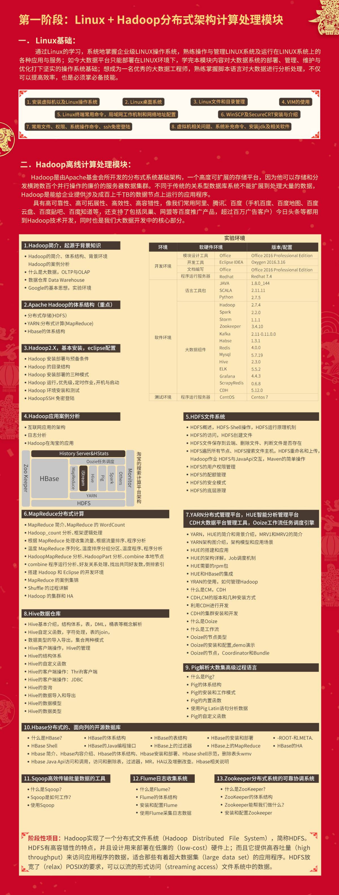

# 大数据学习之路

## 大数据学习路线之一

> https://blog.csdn.net/qq_37187606/article/details/80669708 

### Linux基础和Hadoop分布式架构计算处理模块

1. 学完此阶段可掌握的核心能力：

   熟练使用Linux，熟练安装Linux上的软件，了解熟悉负载均衡、高可靠等集群相关概念，搭建互联网高并发、高可靠的服务架构；

2. 学完此阶段可解决的现实问题：

   搭建负载均衡、高可靠的服务器集群，可以增大网站的并发访问量，保证服务不间断地对外服务；

3. 学完此阶段可拥有的市场价值：

   具备初级程序员必要具备的Linux服务器运维能力。

### Storm实时计算处理

实时课程分为两个部分：流式计算核心技术和流式计算计算案例实战。

#### 流式计算核心技术

流式计算核心技术主要分为两个核心技术点：Storm和Kafka，学完此阶段能够掌握Storm开发及底层原理、Kafka的开发及底层原理、Kafka与Storm集成使用。具备开发基于storm实时计算程序的技术能力。

1. 学完此阶段可掌握的核心能力：

   (1)、理解实时计算及应用场景

   (2)、掌握Storm程序的开发及底层原理、掌握Kafka消息队列的开发及底层原理

   (3)、具备Kafka与Storm集成使用的能力

2. 学完此阶段可解决的现实问题：

   具备开发基于storm的实时计算程序的能力

3. 学完此阶段可拥有的市场价值：

   具备实时计算开发的技术能力、但理解企业业务的能力不足

##### 流式计算一般结构

上图是流式分析的一般架构图，抽象出四个步骤就是数据采集、数据缓冲、数据处理、数据输出。一般情况下，我们采用Flume+kafka+Storm+Redis的结构来进行流式数据分析。实时部分的课程主要是针对Kafka、Storm进行学习

##### Storm核心技术点

1. 基础技术点

   linux环境准备、zookeeper集群搭建、Storm集群搭建、Storm配置文件配置项讲解、集群搭建常见问题解决。

   

2. Storm基础及原理

   Storm常用组件和编程API：Topology、 Spout、Bolt、Storm分组策略(stream groupings)、Storm项目maven环境搭建、使用Strom开发一个WordCount例子、Storm程序本地模式debug、Storm消息可靠性及容错原理、Storm任务提交流程、Strom消息容错机制。

### Spark内存计算处理

1. 学完此阶段可掌握的核心能力：
   1. 掌握Scala函数式编程特性，熟练使用Scala开发程序，可以看懂其他用Scala编写源码。
   2. 搭建Spark集群、使用Scala编写Spark计算程序，熟练掌握Spark原理，可以阅读Spark源码。
   3. 理解DataFrame和RDD之间的关系，熟练使用DataFrame的API，熟练使用Spark SQL处理结构化数据，通过Spark SQL对接各种数据源，并将处理后结果写回到存储介质中。
   4. 理解Spark Streaming的核心DStream，掌握DStream的编程API并编写实时计算程序。

2. 学完此阶段可解决的现实问题：

   熟练使用Scala快速开发Spark大数据应用，通过计算分析大量数据，挖掘出其中有价值的数据，为企业提供决策依据。

3. 学完此阶段可拥有的市场价值：

   学习完spark并掌握其内容，将具备中级大数据工程师能力，薪水可以达到 20K~25K。

#### Scala函数式编程

介绍：Scala是一门集面向对象和函数式编程与一身的编程语言，其强大的表达能力、优雅的API、高效的性能等优点受到越来越多程序员的青睐。Spark底层就是用Scala语言编写，如果想彻底掌握Spark，就必须学好Scala。

案例：Scala编程实战，基于Akka框架，编写一个简单的分布式RPC通信框架

#### 使用Spark处理离线数据

介绍：Spark是基于内存计算的大数据并行计算框架，具有高容错性和高可伸缩性，可以在大量廉价硬件之上部署大规模集群，在同等条件下要比Hadoop快10到100倍。

#### 使用Spark SQL处理结构化数据

介绍：Spark SQL的前身是Shark，专门用来处理结构化的数据，类似Hive，是将SQL转换成一系列RDD任务提交到Spark集群中运行，由于是在内存中完成计算，要比hive的性能高很多，并且简化了开发Spark程序的难度同时提高了开发效率。

#### 使用Spark Streaming完成实时计算

介绍：Spark Streaming类似于Apache Storm，用于流式数据的处理。根据其官方文档介绍，Spark Streaming有高吞吐量和容错能力强等特点。Spark Streaming支持的数据输入源很多，例如：Kafka、Flume、Twitter、ZeroMQ和简单的TCP套接字等等。数据输入后可以用Spark的高度抽象原语如：map、reduce、join、window等进行运算。而结果也能保存在很多地方，如HDFS，数据库等。另外Spark Streaming也能和MLlib(机器学习)以及Graphx完美融合

## 大数据学习路线之二

> http://www.raincent.com/content-10-10850-1.html

### 大数据的三个发展方向

* 平台搭建/优化/运维/监控
* 大数据开发/ 设计/ 架构
* 数据分析/挖掘

### 大数据的4V特征

- 数据量大，TB->PB 
- 数据类型繁多，结构化、非结构化文本、日志、视频、图片、地理位置等
- 商业价值高，但是这种价值需要在海量数据之上，通过数据分析与机器学习更快速的挖掘出来；
- 处理时效性高，海量数据的处理需求不再局限在离线计算当中。

### 大数据相关技术

- 文件存储：Hadoop HDFS、Tachyon、KFS 
- 离线计算：Hadoop MapReduce、Spark 
- 流式、实时计算：Storm、Spark Streaming、S4、Heron 
- K-V、NOSQL数据库：HBase、Redis、MongoDB 
- 资源管理：YARN、Mesos 
- 日志收集：Flume、Scribe、Logstash、Kibana 
- 消息系统：Kafka、StormMQ、ZeroMQ、RabbitMQ 
- 查询分析：Hive、Impala、Pig、Presto、Phoenix、SparkSQL、Drill、Flink、Kylin、Druid 
- 分布式协调服务：Zookeeper 
- 集群管理与监控：Ambari、Ganglia、Nagios、Cloudera Manager 
- 数据挖掘、机器学习：Mahout、Spark MLLib 
- 数据同步：Sqoop 
- 任务调度：Oozie

### 大数据学习路线

- 第一章：初识Hadoop
	- 1.1 学会百度与Google
	- 1.2 参考资料首选官方文档
	* 1.3 先让Hadoop跑起来
	* 1.4 试试使用Hadoop
	* 1.5 你该了解它们的原理了
	* 1.6 自己写一个MapReduce程序
- 第二章：更高效的WordCount
	- 2.1 学点SQL吧
	* 2.2 SQL版WordCount
	- 2.3 SQL On Hadoop之Hive
	- 2.4 安装配置Hive
	* 2.5 试试使用Hive
	- 2.6 Hive是怎么工作的
	* 2.7 学会Hive的基本命令
- 第三章：把别处的数据搞到Hadoop上
	此处也可以叫做数据采集，把各个数据源的数据采集到Hadoop上。
	- 3.1 HDFS PUT命令
	* 3.2 HDFS API
	- 3.3 Sqoop
	- 3.4 Flume
	- 3.5 阿里开源的DataX
- 第四章：把Hadoop上的数据搞到别处去
	Hive和MapReduce进行分析了。那么接下来的问题是，分析完的结果如何从Hadoop上同步到其他系统和应用中去呢？其实，此处的方法和第三章基本一致的。
	- 4.1 HDFS GET命令
	- 4.2 HDFS API
	- 4.3 Sqoop
	- 4.4 DataX
- 第五章：快一点吧，我的SQL
	- 其实大家都已经发现Hive后台使用MapReduce作为执行引擎，实在是有点慢。因此SQL On Hadoop的框架越来越多，按我的了解，最常用的按照流行度依次为SparkSQL、Impala和Presto.这三种框架基于半内存或者全内存，提供了SQL接口来快速查询分析Hadoop上的数据。
	我们目前使用的是SparkSQL，至于为什么用SparkSQL，原因大概有以下吧：使用Spark还做了其他事情，不想引入过多的框架；Impala对内存的需求太大，没有过多资源部署。
	* 5.1 关于Spark和SparkSQL
	* 5.2 如何部署和运行SparkSQL
- 第六章：一夫多妻制
	- 6.1 关于Kafka
	* 6.2 如何部署和使用Kafka
- 第七章：越来越多的分析任务
	* 7.1 Apache Oozie
	* 7.2 其他开源的任务调度系统
- 第八章：我的数据要实时
	* 8.1 Storm
	* 8.2 Spark Streaming
- 第九章：我的数据要对外
- 第十章：牛逼高大上的机器学习

## 参考资料：
- Hadoop The Definitive Guide最新版，这也是我当时的入门书，写的非常好。强烈强烈建议看英文版的，否则容易交流障碍。。。这本书的例子都在github上可以下载下来，都跑一跑。另外Hadoop相关职位的面试问题大部分都来自于这本书，这本书看两遍基本上面试没问题。这是唯一一本我觉得从头到尾必看的书。
- Cloudera的tutorial，user guide，blog和best practice。这个比较官方和实效性。这不是说你要一页一页看完，是你有实际问题自己解决不了了来找参考资料。
    The "Getting Started With Hadoop" tutorialThe "Getting Started With Hadoop" tutorialCloudera Engineering BlogCloudera Engineering BlogCloudera Engineering Blog－另外还有一个传说中的Google三篇论文，那是Distributed System 和Big Data的开山始祖。其实我没看懂。。有兴趣也可以翻一翻。

## 2019-05-14 | 傅腾

单纯大数据集群的话，技术上一般是指 hadoop 和 spark 生态。体系的功能太多，我只从概念、应用和运维层面考虑，其他更多的包括安全，HA可用性，性能等就得专题慢慢看了（Spark 我不熟悉就不说了）

就入门而言，hadoop 建议从 Hive 开始看，毕竟上层是 SQL，容易进入状态。

1. 看 Hive，先解决一个问题：SQL是如何被执行在 hadoop体系的，包括对应的逻辑存储、物理结构、跟HDFS怎么结合、怎么计算（一条Hive SQL的生命之旅）；
2. 等 Hive 看差不多了，基本上对 Hadoop体系的两大支柱 YARN 和 HDFS 有概念性认识了，可以往至少3个方向看：
2.1 横向看，看 HBase、ZK、Flume等应用，和 Spark 体系比较等（体系化，要视野）
2.2 纵向看，看 MapReduce、YARN、HDFS 底层实现等（要深度和后期快速学习和使用其他应用的能力）
2.3 上手用，使用Cloudera体系去运维，搭建一个日志分析系统，调优 SQL、爬虫数据挖掘 等

方法上面，在我们部门，建议：
1. 部门对大数据各个组件的了解已经有一定的积累，但是分散在各个人那里。可以不断找对应人，攻破一些基本概念，快速体系化。比如可以拿着 hadoop 权威指南 翻一遍，对于里面不知道的概念，直接问对应人，沟通到明白为止（会节省大量时间）；
2. 跑各种例子，敲各类命令，结合CM等各软件平台看执行结果，加深理解

入门后的进阶：
-- 这个时候你已经知道怎么进阶了。