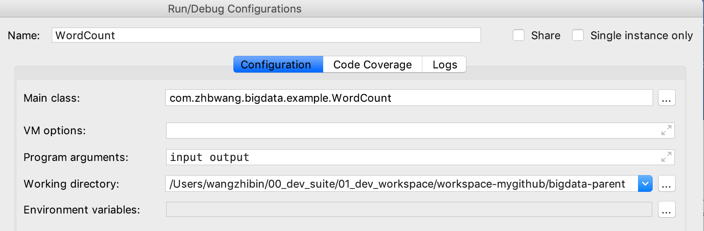
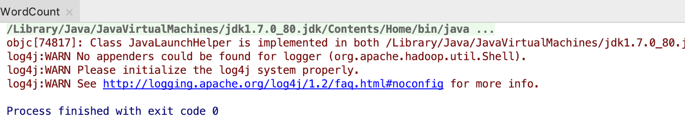
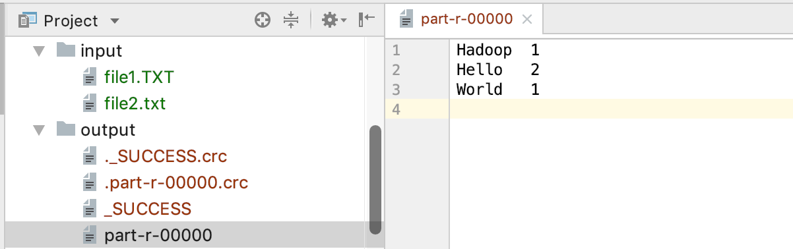
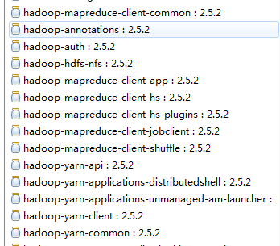

# 使用IDEA开发MapReduce程序

> 2019-05-17 | 大数据学习之路04

## 环境准备

1. jdk1.7
2. intellij idea
3. maven

## 本地MapReduce程序之WordCount

这里以Hadoop的官方示例程序WordCount为例，演示如何一步步编写程序直到运行。

### 新建一个Maven工程

使用idea新建一个普通maven项目bigdata-learn-wordcount

### maven依赖

```xml
    <dependencies>
        <dependency>
            <groupId>org.apache.hadoop</groupId>
            <artifactId>hadoop-common</artifactId>
            <version>2.8.4</version>
        </dependency>
        <dependency>
            <groupId>org.apache.hadoop</groupId>
            <artifactId>hadoop-hdfs</artifactId>
            <version>2.8.4</version>
        </dependency>
        <dependency>
            <groupId>org.apache.hadoop</groupId>
            <artifactId>hadoop-mapreduce-client-core</artifactId>
            <version>2.8.4</version>
        </dependency>
        <dependency>
            <groupId>org.apache.hadoop</groupId>
            <artifactId>hadoop-client</artifactId>
            <version>2.8.4</version>
        </dependency>
    </dependencies>
```

### 拷贝Hadoop中的WordCount源码

```java
/**
 * Licensed to the Apache Software Foundation (ASF) under one
 * or more contributor license agreements.  See the NOTICE file
 * distributed with this work for additional information
 * regarding copyright ownership.  The ASF licenses this file
 * to you under the Apache License, Version 2.0 (the
 * "License"); you may not use this file except in compliance
 * with the License.  You may obtain a copy of the License at
 *
 *     http://www.apache.org/licenses/LICENSE-2.0
 *
 * Unless required by applicable law or agreed to in writing, software
 * distributed under the License is distributed on an "AS IS" BASIS,
 * WITHOUT WARRANTIES OR CONDITIONS OF ANY KIND, either express or implied.
 * See the License for the specific language governing permissions and
 * limitations under the License.
 */

package com.zhbwang.bigdata.example;


import java.io.IOException;
import java.util.StringTokenizer;

import org.apache.hadoop.conf.Configuration;
import org.apache.hadoop.fs.Path;
import org.apache.hadoop.io.IntWritable;
import org.apache.hadoop.io.Text;
import org.apache.hadoop.mapreduce.Job;
import org.apache.hadoop.mapreduce.Mapper;
import org.apache.hadoop.mapreduce.Reducer;
import org.apache.hadoop.mapreduce.lib.input.FileInputFormat;
import org.apache.hadoop.mapreduce.lib.output.FileOutputFormat;
import org.apache.hadoop.util.GenericOptionsParser;

public class WordCount {

    public static class TokenizerMapper
            extends Mapper<Object, Text, Text, IntWritable>{

        private final static IntWritable one = new IntWritable(1);
        private Text word = new Text();

        public void map(Object key, Text value, Context context
        ) throws IOException, InterruptedException {
            StringTokenizer itr = new StringTokenizer(value.toString());
            while (itr.hasMoreTokens()) {
                word.set(itr.nextToken());
                context.write(word, one);
            }
        }
    }

    public static class IntSumReducer
            extends Reducer<Text,IntWritable,Text,IntWritable> {
        private IntWritable result = new IntWritable();

        public void reduce(Text key, Iterable<IntWritable> values,
                           Context context
        ) throws IOException, InterruptedException {
            int sum = 0;
            for (IntWritable val : values) {
                sum += val.get();
            }
            result.set(sum);
            context.write(key, result);
        }
    }

    public static void main(String[] args) throws Exception {
        Configuration conf = new Configuration();
        String[] otherArgs = new GenericOptionsParser(conf, args).getRemainingArgs();
        if (otherArgs.length < 2) {
            System.err.println("Usage: wordcount <in> [<in>...] <out>");
            System.exit(2);
        }
        Job job = Job.getInstance(conf, "word count");
        job.setJarByClass(WordCount.class);
        job.setMapperClass(TokenizerMapper.class);
        job.setCombinerClass(IntSumReducer.class);
        job.setReducerClass(IntSumReducer.class);
        job.setOutputKeyClass(Text.class);
        job.setOutputValueClass(IntWritable.class);
        for (int i = 0; i < otherArgs.length - 1; ++i) {
            FileInputFormat.addInputPath(job, new Path(otherArgs[i]));
        }
        FileOutputFormat.setOutputPath(job,
                new Path(otherArgs[otherArgs.length - 1]));
        System.exit(job.waitForCompletion(true) ? 0 : 1);
    }
}

```

### 初始化文件

在工程根目录新建input文件夹，增加两个文件

```
input
- file1.TXT
Hello World
- file2.txt
Hello Hadoop
```

### 运行配置




### 程序执行


### 执行日志



### 执行结果




## 打包到服务器使用hadoop jar命令执行

### pom.xml增加打包插件

```
        <plugins>
            <!--指定主函数和各个依赖-->
            <plugin>
                <artifactId>maven-assembly-plugin</artifactId>
                <version>2.2</version>
                <configuration>
                    <archive>
                        <manifest>
                            <mainClass>com.zhbwang.bigdata.example.WordCount</mainClass>
                        </manifest>
                    </archive>
                    <descriptorRefs>
                        <descriptorRef>jar-with-dependencies</descriptorRef>
                    </descriptorRefs>
                </configuration>
                <executions>
                    <execution>
                        <id>make-assembly</id>
                        <phase>package</phase>
                        <goals>
                            <goal>single</goal>
                        </goals>
                    </execution>
                </executions>
            </plugin>
        </plugins>
```

### maven打包

```
$ mvn clean install
```

得到一个可执行jar包：`bigdata-learn-wordcount-1.0-SNAPSHOT-jar-with-dependencies.jar`

### 使用java -jar执行

1. 在当前可执行jar目录初始化input文件夹

2. 执行以下命令，即可在当前目录生成output文件夹，里面就是执行结果。

   ```
   java -jar bigdata-learn-wordcount-1.0-SNAPSHOT-jar-with-dependencies.jar input output
   ```

### 使用hadoop jar执行

一开始遇到问题了，还以为打包打的不对，换了几个打包插件都不行。

```
WZB-MacBook:target wangzhibin$ hadoop jar bigdata-learn-wordcount-1.0-SNAPSHOT-jar-with-dependencies.jar /practice/20190517_mr/input /practice/20190517_mr/output
Exception in thread "main" java.io.IOException: Mkdirs failed to create /var/folders/gg/35tlzsrs1kj3c460vh9tvvv40000gn/T/hadoop-unjar2170725475686001105/META-INF/license
	at org.apache.hadoop.util.RunJar.ensureDirectory(RunJar.java:140)
	at org.apache.hadoop.util.RunJar.unJar(RunJar.java:109)
	at org.apache.hadoop.util.RunJar.unJar(RunJar.java:85)
	at org.apache.hadoop.util.RunJar.run(RunJar.java:222)
	at org.apache.hadoop.util.RunJar.main(RunJar.java:148)
```

后来找到几篇文章，发现是**Mac**的问题，在stackoverflow中找到解释：

```
The issue is that a /tmp/hadoop-xxx/xxx/LICENSE file and a
/tmp/hadoop-xxx/xxx/license directory are being created on a
case-insensitive file system when unjarring the mahout jobs.
```

参考资料：

1. [Hadoop java.io.IOException: Mkdirs failed to create /some/path](https://stackoverflow.com/questions/10522835/hadoop-java-io-ioexception-mkdirs-failed-to-create-some-path)
2. [Mac下hadoop运行word count的坑](https://www.cnblogs.com/fanghao/p/8516890.html)

解决方案：删除原来压缩包的META-INF/LICENS即可。

```
zip -d bigdata-learn-wordcount-1.0-SNAPSHOT-jar-with-dependencies.jar META-INF/LICENSE
jar tvf bigdata-learn-wordcount-1.0-SNAPSHOT-jar-with-dependencies.jar | grep LICENSE
```

接下来就可以使用hadoop jar命令执行了。

```
WZB-MacBook:target wangzhibin$ hadoop jar bigdata-learn-wordcount-1.0-SNAPSHOT-jar-with-dependencies.jar /practice/20190517_mr/input /practice/20190517_mr/output
19/05/17 22:07:09 INFO client.RMProxy: Connecting to ResourceManager at /0.0.0.0:8032
19/05/17 22:07:10 INFO input.FileInputFormat: Total input files to process : 2
19/05/17 22:07:10 INFO mapreduce.JobSubmitter: number of splits:2
19/05/17 22:07:10 INFO mapreduce.JobSubmitter: Submitting tokens for job: job_1558078701666_0004
19/05/17 22:07:11 INFO impl.YarnClientImpl: Submitted application application_1558078701666_0004
19/05/17 22:07:11 INFO mapreduce.Job: The url to track the job: http://WZB-MacBook.local:8088/proxy/application_1558078701666_0004/
19/05/17 22:07:11 INFO mapreduce.Job: Running job: job_1558078701666_0004
```

查看结果。

```
WZB-MacBook:target wangzhibin$ hadoop fs -cat /practice/20190517_mr/output/part-r-00000
Hadoop	1
Hello	2
World	1
```

## 问题

### 一、Hadoop 2.x中还有hadoop-core-x.x.jar吗？

答：2.x系列已经没有hadoop-core的jar包了，取而代之的是



对于Hadoop2.x.x版本，需要引入4个jar：

1. hadoop-common
2. hadoop-hdfs
3. hadoop-mapreduce-client-core
4. hadoop-client
5. jdk.tools（一般需要引入，否则报错）

参考：[Hadoop需要的Jar包](https://blog.csdn.net/qq_33813365/article/details/70214484)

## 参考资料

1. [IDEA 配置Hadoop开发（开发调试）](https://www.jianshu.com/p/7e178c952a04)
2. [Hadoop入门学习之（二）：Intellij 开发Hadoop环境搭建](https://www.jianshu.com/p/35ef70dfb651?utm_campaign=maleskine&utm_content=note&utm_medium=seo_notes&utm_source=recommendation)
3. [Hadoop: Intellij结合Maven本地运行和调试MapReduce程序 (无需搭载Hadoop和HDFS环境)](https://www.polarxiong.com/archives/Hadoop-Intellij结合Maven本地运行和调试MapReduce程序-无需搭载Hadoop和HDFS环境.html)
4. [大数据系列（hadoop） 集群环境搭建 idea 开发设置](https://www.cnblogs.com/YellowstonePark/p/7699083.html)
5. [Mac下hadoop运行word count的坑](https://www.cnblogs.com/fanghao/p/8516890.html)