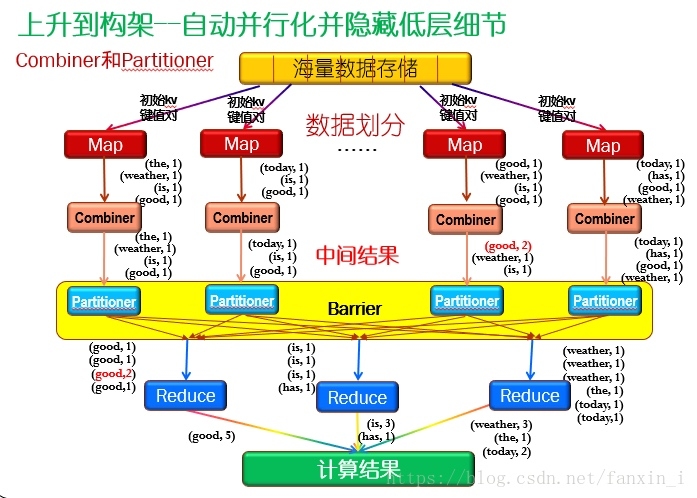
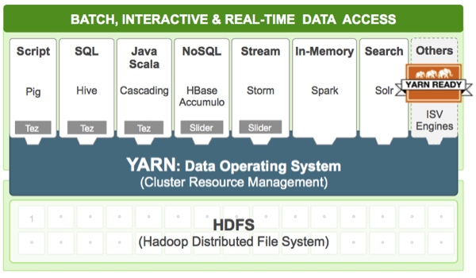
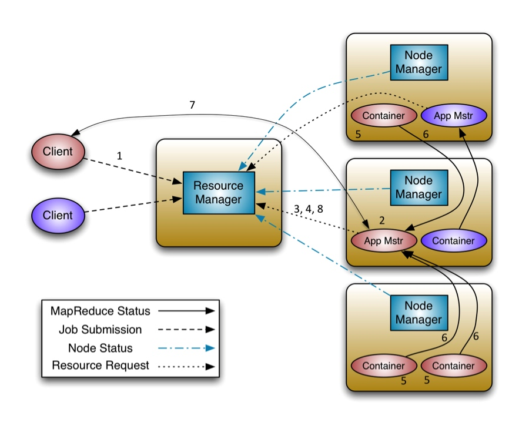

# 2019-05-22 | Hadoop原理与架构解析

> 2019-05-22 | 大数据学习之路05

## Hadoop简介

### 基本介绍

Hadoop 是 Apache 开源组织的一个分布式计算开源框架，是一个可以更容易开发和运行处理大规模数据的解决方案，它提供了一套分布式系统基础架构，允许使用简单的编程模型跨大型计算机的大型数据集进行分布式处理。

### Hadoop架构
Hadoop框架包括以下四个模块：

- Hadoop Common：这些是其他Hadoop模块所需的Java库和实用程序。这些库提供文件系统和操作系统级抽象，并包含启动Hadoop所需的必要Java文件和脚本。
- Hadoop YARN：这是作业调度和集群资源管理的框架。
- Hadoop分布式文件系统（HDFS）：提供对应用程序数据的高吞吐量访问的分布式文件系统。
- Hadoop MapReduce： 这是基于YARN的大型数据集并行处理系统。

Hadoop 框架中最核心的设计就是：MapReduce 和 HDFS。
1. MapReduce 的思想是由 Google 的一篇论文所提及而被广为流传的，简单的一句话解释 MapReduce 就是“任务的分解与结果的汇总”。
2. HDFS 是 Hadoop 分布式文件系统（Hadoop Distributed File System）的缩写，为分布式计算存储提供了底层支持。

## HDFS运行原理

### HDFS简介
HDFS（Hadoop Distributed File System ）Hadoop分布式文件系统。是根据google发表的论文翻版的。论文为GFS（Google File System）Google 文件系统（[中文](http://www.open-open.com/lib/view/open1328763454608.html)，[英文](http://static.googleusercontent.com/media/research.google.com/zh-CN//archive/gfs-sosp2003.pdf)）。

HDFS有很多特点：
1. 保存多个副本，且提供容错机制，副本丢失或宕机自动恢复。默认存3份。为防止某个主机失效读取不到该主机的块文件，它将同一个文件块副本分配到其他某几个主机上。
2. 运行在廉价的机器上。
3. 适合大数据的处理。HDFS会将一个完整的大文件平均分块存储到不同计算机上，默认会将文件分割成block，64M为1个block。然后将block按键值对存储在HDFS上，并将键值对的映射存到内存中。如果小文件太多，那内存的负担会很重。
4. 流式数据访问，一次写入多次读写，和传统文件不同，它不支持动态改变文件内容，而是要求让文件一次写入就不做变化，要变化只能在文件末尾添加

### HDFS架构原理

HDFS 架构原理HDFS采用Master/Slave架构。

1. 一个HDFS集群包含一个单独的NameNode和多个DataNode。
2. NameNode作为Master服务，它负责管理文件系统的命名空间和客户端对文件的访问。NameNode会保存文件系统的具体信息，包括文件信息、文件被分割成具体block块的信息、以及每一个block块归属的DataNode的信息。对于整个集群来说，HDFS通过NameNode对用户提供了一个单一的命名空间。
3. DataNode作为Slave服务，在集群中可以存在多个。通常每一个DataNode都对应于一个物理节点。DataNode负责管理节点上它们拥有的存储，它将存储划分为多个block块，管理block块信息，同时周期性的将其所有的block块信息发送给NameNode。

下图为HDFS系统架构图，主要有三个角色，Client、NameNode、DataNode。

HDFS的一些关键元素

- Block：将文件分块，通常为64M。
- NameNode：是Master节点，是大领导。管理数据块映射；处理客户端的读写请求；配置副本策略；管理HDFS的名称空间。保存整个文件系统的目录信息、文件信息及分块信息，由唯一一台主机专门保存。
- SecondaryNameNode：是一个小弟，分担大哥NameNode的工作量；是NameNode的冷备份；合并fsimage和fsedits然后再发给NameNode。（热备份：b是a的热备份，如果a坏掉。那么b马上运行代替a的工作。冷备份：b是a的冷备份，如果a坏掉。那么b不能马上代替a工作。但是b上存储a的一些信息，减少a坏掉之后的损失。）
- DataNode：是Slave节点，奴隶，干活的。负责存储Client发来的数据块block；执行数据块的读写操作。
- fsimage：元数据镜像文件（文件系统的目录树）
- edits：元数据的操作日志（针对文件系统做的修改操作记录）

HDFS设计重点

1. HDFS 数据备份HDFS被设计成一个可以在大集群中、跨机器、可靠的存储海量数据的框架。它将所有文件存储成block块组成的序列，除了最后一个block块，所有的block块大小都是一样的。
2. HDFS中的文件默认规则是write one（一次写、多次读）的，并且严格要求在任何时候只有一个writer。
3. NameNode全权管理数据块的复制，它周期性地从集群中的每个DataNode接受心跳信号和块状态报告（BlockReport）。接收到心跳信号以为该DataNode工作正常，块状态报告包含了一个该DataNode上所有数据块的列表。
4. NameNode内存中存储的是=fsimage+edits。SecondaryNameNode负责定时（默认1小时）从NameNode上，获取fsimage和edits来进行合并，然后再发送给NameNode。减少NameNode的工作量。

### 文件写入

Client向NameNode发起文件写入的请求。
1. NameNode根据文件大小和文件块配置情况，返回给Client它所管理部分DataNode的信息。
2. Client将文件划分为多个block块，并根据DataNode的地址信息，按顺序写入到每一个DataNode块中。

以下过程完全参考自（[【Hadoop】HDFS的运行原理](https://www.cnblogs.com/laov/p/3434917.html)）

例如：有一个文件FileA，100M大小。Client将FileA写入到HDFS上。
1. HDFS按默认配置。
2. HDFS分布在三个机架上Rack1，Rack2，Rack3。

文件写入过程如下：
1. Client将FileA按64M分块。分成两块，block1和Block2;
2. Client向NameNode发送写数据请求，如图蓝色虚线①------>。
3. NameNode节点，记录block信息。并返回可用的DataNode，如粉色虚线②--------->。
    1. Block1: host2,host1,host3
    2. Block2: host7,host8,host4
    3. 原理：
        1. NameNode具有RackAware机架感知功能，这个可以配置。
        2. 若Client为DataNode节点，那存储block时，规则为：副本1，同Client的节点上；副本2，不同机架节点上；副本3，同第二个副本机架的另一个节点上；其他副本随机挑选。
        3. 若Client不为DataNode节点，那存储block时，规则为：副本1，随机选择一个节点上；副本2，不同副本1，机架上；副本3，同副本2相同的另一个节点上；其他副本随机挑选。
4. Client向DataNode发送block1；发送过程是以流式写入。流式写入过程如下：
    1. 将64M的block1按64k的package划分;
    2. 然后将第一个package发送给host2;
    3. host2接收完后，将第一个package发送给host1，同时Client想host2发送第二个package；
    4. host1接收完第一个package后，发送给host3，同时接收host2发来的第二个package。
    5. 以此类推，如图红线实线所示，直到将block1发送完毕。
    6. host2,host1,host3向NameNode，host2向Client发送通知，说“消息发送完了”。如图粉红颜色实线所示。
    7. Client收到host2发来的消息后，向NameNode发送消息，说我写完了。这样就真完成了。如图黄色粗实线
    8. 发送完block1后，再向host7、host8、host4发送block2，如图蓝色实线所示。
    9. 发送完block2后，host7、host8、host4向NameNode，host7向Client发送通知，如图浅绿色实线所示。
    10. Client向NameNode发送消息，说我写完了，如图黄色粗实线。。。这样就完毕了。
5. 分析：通过写过程，我们可以了解到
    1. 写1T文件，我们需要3T的存储，3T的网络流量贷款。
    2. 在执行读或写的过程中，NameNode和DataNode通过HeartBeat进行保存通信，确定DataNode活着。如果发现DataNode死掉了，就将死掉的DataNode上的数据，放到其他节点去。读取时，要读其他节点去。
    3. 挂掉一个节点，没关系，还有其他节点可以备份；甚至，挂掉某一个机架，也没关系；其他机架上，也有备份。

    
### 文件读取
当文件读取：
1. Client向NameNode发起文件读取的请求。
2. NameNode返回文件存储的block块信息、及其block块所在DataNode的信息。
3. Client读取文件信息。

如图所示，Client要从DataNode上，读取FileA。而FileA由block1和block2组成。读操作流程如下：

1. Client向NameNode发送读请求。
2. NameNode查看Metadata信息，返回FileA的block的位置。
    1. block1:host2,host1,host3
    2. block2:host7,host8,host4
3. block的位置是有先后顺序的，先读block1，再读block2。而且block1去host2上读取；然后block2，去host7上读取。

上面例子中，Client位于机架外，那么如果Client位于机架内某个DataNode上，例如,Client是host6。那么读取的时候，遵循的规律是：**优选读取本机架上的数据。**

问题：如果读取block是按照先后顺序读，是否意味着在不同副本之间的读取是不平均的，没有考虑通过负载策略来提高读效率吗？

### 备份数据的存放

备份数据的存放是HDFS可靠性和性能的关键。HDFS采用一种称为rack-aware的策略来决定备份数据的存放。

通过一个称为Rack Awareness的过程，NameNode决定每个DataNode所属rack id。

缺省情况下，一个block块会有三个备份：
1. 一个在NameNode指定的DataNode上
2. 一个在指定DataNode非同一rack的DataNode上
3. 一个在指定DataNode同一rack的DataNode上。

这种策略综合考虑了同一rack失效、以及不同rack之间数据复制性能问题。

副本的选择：为了降低整体的带宽消耗和读取延时，HDFS会尽量读取最近的副本。如果在同一个rack上有一个副本，那么就读该副本。如果一个HDFS集群跨越多个数据中心，那么将首先尝试读本地数据中心的副本。

## MapReduce运行原理

### MapReduce简介

MapReduce是一种分布式计算模型，由Google提出，主要用于搜索领域，解决海量数据的计算问题。

MapReduce分成两个部分：Map（映射）和Reduce（归纳）。
1. 当你向MapReduce框架提交一个计算作业时，它会首先把计算作业拆分成若干个Map任务，然后分配到不同的节点上去执行，每一个Map任务处理输入数据中的一部分。
2. 当Map任务完成后，它会生成一些中间文件，这些中间文件将会作为Reduce任务的输入数据。Reduce任务的主要目标就是把前面若干个Map的输出汇总并输出。

### MapReduce的基本模型和处理思想
大规模数据处理时，MapReduce在三个层面上的基本构思
> 参考（[MapReduce的基本工作原理](https://blog.csdn.net/fanxin_i/article/details/80388221)）

####  **如何对付大数据处理：分而治之**

对相互间不具有计算依赖关系的大数据，实现并行最自然的办法就是采取分而治之的策略。

什么样的计算任务可进行并行化计算？
A：**不可分拆的计算任务或相互间有依赖关系的数据无法进行并行计算！**

一个大数据若可以分为具有同样计算过程的数据块，并且这些数据块之间不存在数据依赖关系，则提高处理速度的最好办法就是并行计算。

#### **上升到抽象模型：Mapper与Reducer**

MPI等并行计算方法缺少高层并行编程模型，为了克服这一缺陷，MapReduce借鉴了Lisp函数式语言中的思想，用Map和Reduce两个函数提供了高层的并行编程抽象模型。

关键思想：为大数据处理过程中的两个主要处理操作提供一种抽象机制。Map和Reduce为程序员提供了一个清晰的操作接口抽象描述。

MapReduce借鉴了函数式程序设计语言Lisp中的思想，定义了如下的Map和Reduce两个抽象的编程接口，由用户去编程实现:

1. map: (k1; v1) → [(k2; v2)]。
    * 输入：键值对(k1; v1)表示的数据
    * 处理：文档数据记录(如文本文件中的行，或数据表格中的行)将以“键值对”形式传入map函数；map函数将处理这些键值对，并以另一种键值对形式输出处理的一组键值对中间结果[(k2; v2)]
    * 输出：键值对[(k2; v2)]表示的一组中间数据

2. —reduce: (k2; [v2]) → [(k3; v3)]
    * 输入： 由map输出的一组键值对[(k2; v2)] 将被进行合并处理将同样主键下的不同数值合并到一个列表[v2]中，故reduce的输入为(k2; [v2])
    * 处理：对传入的中间结果列表数据进行某种整理或进一步的处理,并产生最终的某种形式的结果输出[(k3; v3)] 。
    * 输出：最终输出结果[(k3; v3)]

示例：假设有4组原始文本数据
* Text 1: the weather is good 
* Text 2: today is good    
* Text 3: good weather is good 
* Text 4: today has good weather

MapReduce处理方式：
1. 使用4个map节点：
    * map节点1:
        * 输入：(text1, “the weather is good”)
        * 输出：(the, 1), (weather, 1), (is, 1), (good, 1)
    * map节点2:
        * 输入：(text2, “today is good”)
        * 输出：(today, 1), (is, 1), (good, 1)
    * map节点3:
        * 输入：(text3, “good weather is good”)
        * 输出：(good, 1), (weather, 1), (is, 1), (good, 1)
    * map节点4:
        * 输入：(text3, “today has good weather”)
        * 输出：(today, 1), (has, 1), (good, 1), (weather, 1)
2. 使用3个reduce节点：
    * reduce节点1：
        * 输入：(good, 1),(good, 1),(good, 1),(good, 1),(good, 1)
        * 输出：(good, 5)
    * reduce节点2：
        * 输入：(has, 1),(is, 1),(is, 1),(is, 1)
        * 输出：(has, 1),(is, 3)
    * reduce节点3：
        * 输入：(the, 1),(today, 1),(today, 1),(weather, 1),(weather, 1),(weather, 1)
        * 输出：(the, 1),(today, 2),(weather, 3)

####  **上升到构架：统一构架，为程序员隐藏系统层细节**
MPI等并行计算方法缺少统一的计算框架支持，程序员需要考虑数据存储、划分、分发、结果收集、错误恢复等诸多细节；为此，MapReduce设计并提供了统一的计算框架，为程序员隐藏了绝大多数系统层面的处理细节。

1. —各个map函数对所划分的数据并行处理，从不同的输入数据产生不同的中间结果输出
2. 各个reduce也各自并行计算，各自负责处理不同的中间结果数据集合—进行reduce处理之前，必须等到所有的map函数做完，因此，在进入reduce前需要有一个同步障(barrier)；这个阶段也负责对map的中间结果数据进行收集整理(aggregation & shuffle)处理，以便reduce更有效地计算最终结果—最终汇总所有reduce的输出结果即可获得最终结果。

MapReduce提供一个统一的计算框架，可完成：
* —计算任务的划分和调度
* 数据的分布存储和划分
* —处理数据与计算任务的同步
* —结果数据的收集整理(sorting, combining, partitioning,…)
* —系统通信、负载平衡、计算性能优化处理
* —处理系统节点出错检测和失效恢复

### MapReduce运行流程

#### MapReduce的物理架构

Map-Reduce的处理过程主要涉及以下四个部分：

* 客户端Client：用于提交Map-reduce任务job
* JobTracker：协调整个job的运行，其为一个Java进程，其main class为JobTracker
* TaskTracker：运行此job的task，处理input split，其为一个Java进程，其main class为TaskTracker
* HDFS：hadoop分布式文件系统，用于在各个进程间共享Job相关的文件

#### MapReduce的逻辑运行流程

MapReduce运行按照时间顺序包括五个阶段：输入分片（input split）、map阶段、combiner阶段、shuffle阶段和reduce阶段。

1. 输入分片（input split）
    * 在进行map计算之前，mapreduce会根据输入文件计算输入分片（input split），每个输入分片（input split）针对一个map任务。
    * 输入分片（input split）存储的并非数据本身，而是一个分片长度和一个记录数据的位置的数组
    * 输入分片（input split）和hdfs的block（块）关系很密切。假如我们设定hdfs的块的大小是64mb，如果我们输入有三个文件，大小分别是3mb、65mb和127mb，那么mapreduce会把3mb文件分为一个输入分片（input split），65mb则是两个输入分片（input split）而127mb也是两个输入分片（input split），那么就会有5个map任务将执行，而且每个map执行的数据大小不均，这个也是mapreduce优化计算的一个关键点。
2. map阶段：就是程序员编写好的map函数了，因此map函数效率相对好控制，而且一般map操作都是本地化操作也就是在数据存储节点上进行。
3. combiner阶段：
    * Combiner是一个本地化的reduce操作，主要是在map计算出中间文件前做一个简单的合并重复key值的操作
4. shuffle阶段
    * 将map的输出作为reduce的输入的过程就是shuffle了，这个是mapreduce优化的重点地方。
    * 具体shuffle的过程不介绍了。
5. reduce阶段：和map函数一样也是程序员编写的，最终结果是存储在hdfs上的。

简单的来说：
1. 有一个待处理的大数据，被划分成大小相同的数据库(如64MB)，以及与此相应的用户作业程序。
2. 系统中有一个负责调度的主节点(JobTracker)，以及数据Map和Reduce工作节点(TaskTracker).
3. 用户作业提交给主节点JobTracker。
4. 主节点为作业程序寻找和配备可用的Map节点，并将程序传送给map节点。
5. 主节点也为作业程序寻找和配备可用的Reduce节点，并将程序传送给Reduce节点。
6. 主节点启动每一个Map节点执行程序，每个Map节点尽可能读取本地或本机架的数据进行计算。(实现代码向数据靠拢，减少集群中数据的通信量)。
7. 每个Map节点处理读取的数据块，并做一些数据整理工作(combining,sorting等)并将数据存储在本地机器上；同时通知主节点计算任务完成并告知主节点中间结果数据的存储位置。
8. 主节点等所有Map节点计算完成后，开始启动Reduce节点运行；Reduce节点从主节点所掌握的中间结果数据位置信息，远程读取这些数据。
9. Reduce节点计算结果汇总输出到一个结果文件，即获得整个处理结果。

## YARN运行原理
### YARN简介
Yarn是Hadoop集群的分布式资源管理系统。Hadoop2.0对MapReduce框架做了彻底的设计重构，我们称Hadoop2.0中的MapReduce为MRv2或者Yarn，YARN是为了提高分布式的集群环境下的资源利用率，这些资源包括内存、IO、网络、磁盘等。其产生的原因是为了解决原MapReduce框架的不足。

### 原MapReduce框架的不足
Hadoop 原 MapReduce 架构如下：

原 MapReduce 程序的流程及设计思路：
1. 首先用户程序 (JobClient) 提交了一个 job，job 的信息会发送到 Job Tracker 中，Job Tracker 是 Map-reduce 框架的中心，他需要与集群中的机器定时通信 (heartbeat), 需要管理哪些程序应该跑在哪些机器上，需要管理所有 job 失败、重启等操作。
2. TaskTracker 是 Map-reduce 集群中每台机器都有的一个部分，他做的事情主要是监视自己所在机器的资源情况。
3. TaskTracker 同时监视当前机器的 tasks 运行状况。TaskTracker 需要把这些信息通过 heartbeat 发送给 JobTracker，JobTracker 会搜集这些信息以给新提交的 job 分配运行在哪些机器上。上图虚线箭头就是表示消息的发送 - 接收的过程。

随着分布式系统集群的规模和其工作负荷的增长，原框架的问题逐渐浮出水面，主要的问题集中如下：
1. JobTracker 是 Map-reduce 的集中处理点，存在单点故障。
2. JobTracker需要完成的任务太多，既要维护job的状态又要维护job的task的状态，造成过多的资源消耗。业界普遍总结出老 Hadoop 的 Map-Reduce 只能支持 4000 节点主机的上限。
3. 在 TaskTracker 端，以 map/reduce task 的数目作为资源的表示过于简单，没有考虑到 cpu/ 内存的占用情况，如果两个大内存消耗的 task 被调度到了一块，很容易出现 OOM。
4. 在 TaskTracker 端，把资源强制划分为 map task slot 和 reduce task slot, 如果当系统中只有 map task 或者只有 reduce task 的时候，会造成资源的浪费，也就是前面提过的集群资源利用的问题。
5. 源代码层面分析的时候，会发现代码非常的难读，常常因为一个 class 做了太多的事情，代码量达 3000 多行，造成 class 的任务不清晰，增加 bug 修复和版本维护的难度。
6. 从操作的角度来看，现在的 Hadoop MapReduce 框架在有任何重要的或者不重要的变化 ( 例如 bug 修复，性能提升和特性化 ) 时，都会强制进行系统级别的升级更新。更糟的是，它不管用户的喜好，强制让分布式集群系统的每一个用户端同时更新。这些更新会让用户为了验证他们之前的应用程序是不是适用新的 Hadoop 版本而浪费大量时间。

### Yarn/MRv2的产生
为从根本上解决旧 MapReduce 框架的性能瓶颈，促进 Hadoop 框架的更长远发展，从 0.23.0 版本开始，Hadoop 的 MapReduce 框架完全重构，发生了根本的变化。新的 Hadoop MapReduce 框架命名为 MapReduceV2 或者叫 Yarn。

1. 在Yarn中把job的概念换成了application，因为在新的Hadoop2.x中，运行的应用不只是MapReduce了，还有可能是其它应用如一个DAG（有向无环图Directed Acyclic Graph，例如storm应用）。
2. Yarn的另一个目标就是拓展Hadoop，使得它不仅仅可以支持MapReduce计算，还能很方便的管理诸如Hive、Hbase、Pig、Spark/Shark等应用。各种应用就可以互不干扰的运行在同一个Hadoop系统中，共享整个集群资源。
    

### YARN组件与架构
Yarn主要由以下几个组件组成：

1. ResourceManager：Global（全局）的进程 
2. NodeManager：运行在每个节点上的进程
3. ApplicationMaster：Application-specific（应用级别）的进程。ApplicationMaster是对运行在Yarn中某个应用的抽象，它其实就是某个类型应用的实例，ApplicationMaster是应用级别的，它的主要功能就是向ResourceManager（全局的）申请计算资源（Containers）并且和NodeManager交互来执行和监控具体的task。
4. *Scheduler：是ResourceManager的一个组件*。Scheduler是ResourceManager专门进行资源管理的一个组件，负责分配NodeManager上的Container资源，NodeManager也会不断发送自己Container使用情况给ResourceManager。
5. *Container：节点上一组CPU和内存资源*。Container是Yarn对计算机计算资源的抽象，它其实就是一组CPU和内存资源，所有的应用都会运行在Container中。

新的 Hadoop MapReduce 框架（Yarn）架构

###  YARN执行过程
Application在Yarn中的执行过程，整个执行过程可以总结为三步：
1. 应用程序提交
2. 启动应用的ApplicationMaster实例
3. ApplicationMaster实例管理应用程序的执行

1. 客户端程序向ResourceManager提交应用并请求一个ApplicationMaster实例
2. ResourceManager找到可以运行一个Container的NodeManager，并在这个Container中启动ApplicationMaster实例
3. ApplicationMaster向ResourceManager进行注册，注册之后客户端就可以查询ResourceManager获得自己ApplicationMaster的详细信息，以后就可以和自己的ApplicationMaster直接交互了
4. 在平常的操作过程中，ApplicationMaster根据resource-request协议向ResourceManager发送resource-request请求
5. 当Container被成功分配之后，ApplicationMaster通过向NodeManager发送container-launch-specification信息来启动Container， container-launch-specification信息包含了能够让Container和ApplicationMaster交流所需要的资料
6. 应用程序的代码在启动的Container中运行，并把运行的进度、状态等信息通过application-specific协议发送给ApplicationMaster
7. 在应用程序运行期间，提交应用的客户端主动和ApplicationMaster交流获得应用的运行状态、进度更新等信息，交流的协议也是application-specific协议
8. 一但应用程序执行完成并且所有相关工作也已经完成，ApplicationMaster向ResourceManager取消注册然后关闭，用到所有的Container也归还给系统
。

## 参考资料

1. [Hadoop简介](https://www.jianshu.com/p/ac98bd415baa)
2. [分布式计算开源框架 Hadoop 介绍](https://www.infoq.cn/article/hadoop-intro)
3. [Hadoop-介绍](https://www.jianshu.com/p/a3c4f6f5f60a)
4. [【Hadoop】HDFS的运行原理](https://www.cnblogs.com/laov/p/3434917.html)
5. [分布式计算框架Hadoop原理及架构全解](https://www.jianshu.com/p/0b05318b264b)
6. [Hadoop 原理总结](https://www.jianshu.com/p/398d0d8c9d87)
7. [MapReduce原理与设计思想](https://www.cnblogs.com/wuyudong/p/mapreduce-principle.html)
8. [MapReduce的基本工作原理](https://blog.csdn.net/fanxin_i/article/details/80388221)
9. [Hadoop 之MapReduce 运行原理全解析](https://blog.csdn.net/xuanjiewu/article/details/50563118)
10. [hadoop 学习笔记：mapreduce框架详解](https://www.cnblogs.com/sharpxiajun/p/3151395.html)
11. [Hadoop核心之HDFS 架构设计](https://blog.csdn.net/suifeng3051/article/details/48548341)
12. [Hadoop核心之MapReduce架构设计](https://blog.csdn.net/suifeng3051/article/details/49364677)
13. [Hadoop Yarn详解](https://blog.csdn.net/suifeng3051/article/details/49486927)
14. [Hadoop 新 MapReduce 框架 Yarn 详解](https://www.ibm.com/developerworks/cn/opensource/os-cn-hadoop-yarn/)