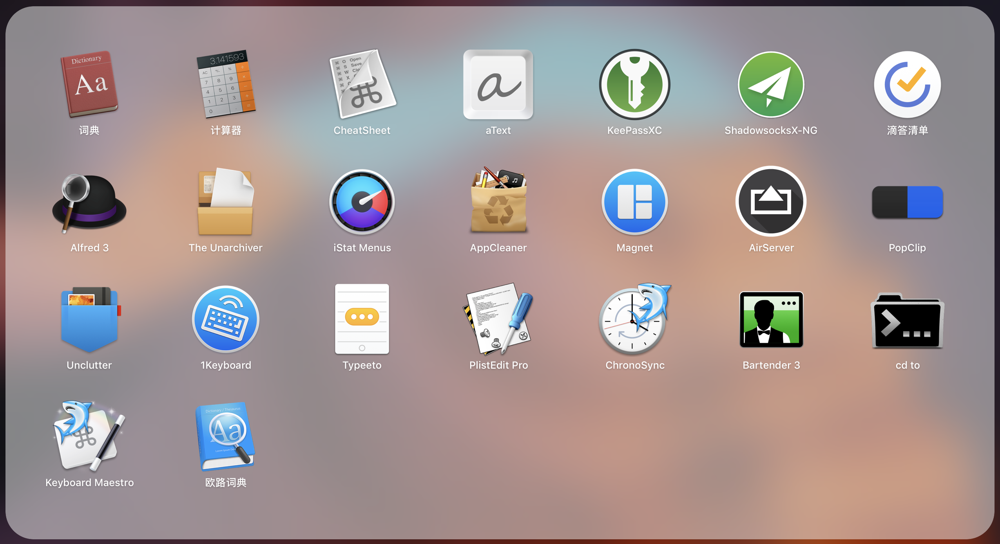
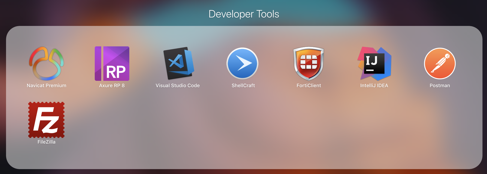
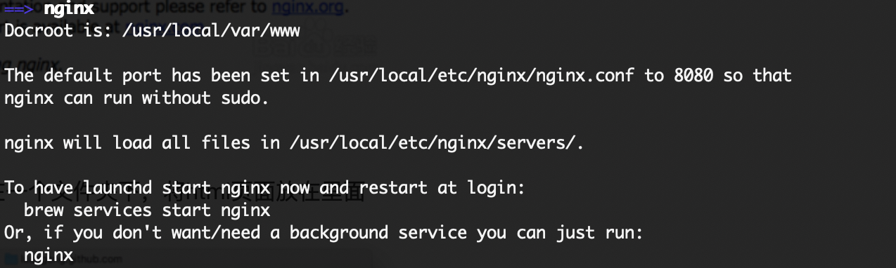
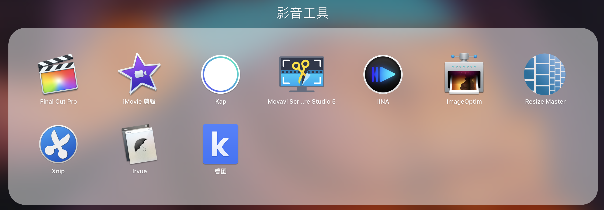

# 软件 | MacOS中有哪些比较好的软件

>2018-09-04 购机 

## Mac常用软件
1. 印象笔记/Evernote
2. QQ/QQ音乐
3. Parallels Desktop for Mac V14：Mac下最省心的虚拟机。
   1. <https://www.newasp.net/soft/454880.html>
   2. <http://down-www.newasp.net/pcdown/soft/mac/parallelsdesktop14crack.dmg>
   3. <https://www.xp510.com/xiazai/ossoft/mactools/45226.html>
4. parallels client ： mac下最好用的windows远程桌面连接软件。
5. shadowsockX-NG：mac下的翻墙工具，需要自备ss账号。
6. google chrome：不解释
7. cornerstone：Mac下的svn工具。暂时没有找到理想的，这个还算不错。
8. 坚果云：全平台云同步服务
9. keepassXC 2.3.4：keepass密码管理工具
10. microsoft offic for mac/wps for mac：Mac下支持Office真的很差，只能用这两个了，WPS在2018年底才出来，还需要优化。
11. foxmail
12. 微云（主要是为了下载mac软件）
13. FUSE for macOS 3.8.2：Mac下读写MTFS神器
    - <https://github.com/osxfuse/osxfuse/releases>
14. Omni系列

## Mac效率软件

1. cheatsheet：<https://www.mediaatelier.com/CheatSheet/>
2. atext
3. alfred 3 （破解需要xcode command line）
4. betterTouchTools（还需要研究一下怎么用。）
    1. 可以设置三指点击，=快捷键command+W，关闭标签页。
5. Keyboard Maestro：
    1. [如何用自动化神器 Keyboard Maestro，高效做读书笔记？（附教程）](https://www.ifanr.com/app/796750)
    2. [让你的Mac成为超高效率的工作工具(Keyboard Maestro 和 Alfred的整合)](https://www.jianshu.com/p/105c7c017f23)
6. AppCleaner：轻量级软件卸载工具
7. Dr. clean pro：Mac下的系统优化软件。
8. the unarchiver：Mac下的压缩与解压缩软件
9. iStat Menus_6.20 mac系统监控神器，可以显示电池剩余时间。
10. 从finder到终端的小插件：cdto
   - <https://www.gracecode.com/posts/3081.html>
   - <https://github.com/jbtule/cdto>
11. Magnet：可以快速实现窗口并排
12. AirServer：iPad投屏到Mac
13. PopClip：快捷菜单，可以实现各种快捷操作。不太好的一点，就是每次选中都会有一个Command+c的操作，在Excel里面用的时候，就不爽了。
14. Typeeto/1Keyboard：可以实现mac键盘充当iphone、ipad蓝牙键盘。神器。
15. Bartender：Mac任务栏精简工具，可以把不常用的图标收缩起来。
16. iText：一款从图片中识别文字、并翻译的工具。先安装1.2.8版本，然后使用appstore升级。

## 开发/编辑器

1. axure：原型设计
2. navicat：数据库管理
3. typaro：最好用的Markdown编辑器
    1. pandoc，为了能导出word。<https://github.com/jgm/pandoc/releases/tag/2.2.3.2>
4. macdown，与Typora配合，可以复制完整带格式的文本到邮件。轻量。但是不能拷贝图片。
5. idea
6. xcode command line
7. jdk7/8
8. maven
    - <https://www.jianshu.com/p/191685a33786>
9. 安装brew，主要是为了把原生的svn1.9降级到1.8，兼容cornerstone3.0.3
    - <https://www.jianshu.com/p/4e80b42823d5>
    - svn降级 ：<https://note.devework.com/mac/mac-svn.html>
10. nodejs
   1. <https://nodejs.org/en/#download>，官网下载安装
   2. Node.js v10.10.0 to /usr/local/bin/node
   3. npm v6.4.1 to /usr/local/bin/npm
   4. 安装cnpm：[http://npm.taobao.org](http://npm.taobao.org/)
   5. \# npm install -g cnpm --registry=[https://registry.npm.taobao.org](https://registry.npm.taobao.org/) 
11. Visual Studio Code：轻量开发编辑器
12. FortiClient：SSLVPN客户端
13. PostMan：http测试工具
14. FileZilla：FTP、SFTP客户端
15. nginx：brew install nginx
    1. 

## 影音工具

1. Xnip：长图截图工具
2. Irvue：自动切换壁纸
3. 看图：腾讯出品的图片查看器
4. IINA：好用的视频播放器
5. Final Cut Pro：不解释
6. Movavi Screen Capture Studio 5：视频编辑
7. Kap：轻量的录屏软件
8. Resize Master：图片缩放工具
9. LICEcap：gip录屏软件。

## **windows虚拟机安装软件**

1. 360zip
2. qq(主要是为了远程桌面)
3. microsoft office
4. microsoft project
5. visio
6. powerdesigner 16
7. VPN客户端
8. PanDown客户端：PanDownload 2.0.1，不限速，百度云下载加速器。下载：
   1. <https://www.gdaily.org/15944/pandownload>
   2. [https://pandownload.com](https://pandownload.com/)

## 哪些已经尝试了但放弃了

1. DEVONThink：https://sspai.com/post/44648
   1. 因为对中文的支持不太好，中文搜索与中文格式编码的支持不太好。
   2. 占用资源太大，大约2G内存。
   3. 使用Idex方式，无法与finder中的文件同步
   4. 2019-01-24 折腾了几个小时，发现用不起来，还是放弃。
2. Path Finder
   1.  因为没有什么特色，也没有比原生的finder更好用。放弃！
3. XtraFinder（启用SIP：<https://www.jianshu.com/p/a47e96645d88>）
   1. 因为需要启用SIP，怕影响原生系统，放弃了。

## **电池使用记录**

### **2018-09-05 工作使用场景（开PD虚拟机）**

| **日期**   | **开始时间** | **结束时间** | **开始电量** | **结束电量** | **使用时间** |
| ---------- | ------------ | ------------ | ------------ | ------------ | ------------ |
| 2018-09-05 | 09:00        | 11:30        | 100%         | 55%          | 2.5小时      |
| 2018-09-05 | 13:30        | 15:00        | 50%          | 30%          | 1.5小时      |
| 2018-09-05 | 15:00        | 16:00        | 30%          | 10%          | 1小时        |
| 2018-09-05 | 16:00        | 16:23        | 10%          | 5%           | 0.5小时      |

## **Mac快捷键使用**

- MacOS
  - command + Q 关闭APP
  - command + Q 锁屏
  - mac中delete键的5种用法：
  - - 第一种：按 delete 键，实现 Windows 键盘上退格键的功能，也就是删除光标之前的一个字符（默认）；
    - 第二种：按 fn+delete 键，删除光标之后的一个字符；
    - 第三种：按 option+delete 键，删除光标之前的一个单词（英文有效）；
    - 第四种：结合第二种，按住fn+option+delete，删除光标之后的一个单词；
    - 第五种：选中文件后按 command+delete，删除掉该文件。
- QQ
  - command + M 最小化qq
  - shift + command + W 打开联系人（自定义）
  - shift + command + G 搜索联系人（自定义）
  - ctrl + command + A 截图
  - ctrl + command + F 搜索联系人
- Evernote
  - 最好用的快捷键：<https://www.ifanr.com/app/643581>
  - - command + J 启动快捷搜索框
    - ctrl + command + N 快捷笔记面板
  - 印象笔记的markdown仅适合用来写文章。不能用快捷键返回和前进
  - 返回和前进的快捷键：command + [ 返回 / command + ] 前进
  - 删除线 ： ctrl + command + K
  - ⌘ N 新記事
  - ⌥ ⌘ S 显示/隐藏侧边栏
  - 全局快捷键
    - Ctrl ⌘ E 在 Evernote 中搜尋
    - Ctrl ⌥ ⌘ N 新記事視窗
    - Ctrl ⌘ N 快速記事
- Safari浏览器切换标签快捷键（参考：<https://sspai.com/post/30902>，《Safari for OS X 你不可不知的 10 个快捷键》）
  - 从左向右切换标签的快捷键是： Control + tab.
  - 反向切换标签则是： Control + shift + tab.
  - Option + tab/command + shift + tab 标签切换。
  - command + w 关闭当前标签
  - command + z 重新打开
  - command + [ 上一页
  - command + ] 下一页
  - command + shift + b 显示隐藏收藏栏。
  - command + shift + L 打开侧边栏
  - command + 单击链接，实现在后台打开新标签页。
  - command + R 刷新
- Mac 自动操作 APP 设置
  - 全局
    - command + \ 打开finder
    - shift + command + E 打开Evernote
    - shift + command + W 打开QQ
    - *
- Keyboard Maestro快捷键设置
  - option+command为打开Application的快捷键前缀
  - option+数字为最常用的文件夹与文件快捷键

## **Mac小技巧**

- 如何从finder中文件夹进入terminal？
  - 打开Finder中的服务偏好设置，勾选快捷键tab下新建位于文件夹位置的终端窗口。
  - 从finder到终端的小插件 cdto
- 查看Mac电量剩余使用时间
  - 打开活动监视器-能耗标签，可以查看。
  - 使用iStat Menus_6.20 mac系统监控神器，可以显示电池剩余时间。
- 安装jdk
  - 安装目录：/Library/Java/JavaVirtualMachines/jdk1.8.0_181.jdk/Contents/Home/bin/java
  - 多版本jdk切换：<https://blog.csdn.net/tianxiawuzhei/article/details/48263789>
- 输入全角空格
  - 按Shift+Option(Alt)+B组合键打开符号选择框，在底部选中“符号”选项，第六个就是。
  - 参考：<https://www.jianshu.com/p/d0ffea021315>
- mac上右键菜单新增文件夹打开方式
  - <https://www.jianshu.com/p/d5f21b8b79e8>
- **Mac下的【预览】工具增强插件：**
  - <https://www.jianshu.com/p/9b9e53db22c9>

## **Alfred使用**

- [http://www.alfredworkflow.com](http://www.alfredworkflow.com/)
- <https://sspai.com/post/44624>
- 与文件相关的命令
  - find
  - in
  - open
  - \>
- 常用的一些自定义搜索配置。
  - 百度：<https://www.baidu.com/s?ie=utf-8&f=8&wd=>{query}
  - 简书：<http://www.jianshu.com/search?utf8=%E2%9C%93&q=>{query}
  - 淘宝：<http://s.taobao.com/search?oe=utf-8&f=8&q=>{query}
  - 京东：<https://search.jd.com/Search?keyword=>{query}&enc=utf-8&wq={query}
  - 微信文章：<http://weixin.sogou.com/weixin?type=2&query=>{query}
  - stackoverflow：<http://www.stackoverflow.com/search?q=>{query}
  - github：<https://github.com/search?utf8=%E2%9C%93&q=>{query}
  - maven：<http://mvnrepository.com/search?q=>{query}
  - Android API Search：<https://developer.android.com/reference/classes.html#q=>{query}
- Alfred + Evernote：<https://www.jianshu.com/p/604d7519b6ed>
  - <https://www.alfredforum.com/topic/840-evernote-workflow-9-beta-3/?tab=comments#comment-4055>
- <http://alfredworkflow.com/>

## **推荐软件**

- <https://github.com/hzlzh/Best-App/blob/master/README.md>
  - 

