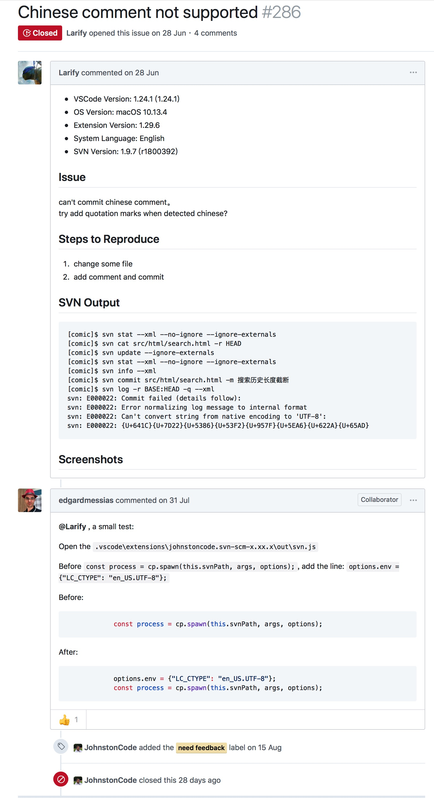

# Visual Studio Code SVN插件encoding 问题

## 问题

在Visual Studio Code的SVN插件svn: Can't convert string from native encoding to 'UTF-8’ 

## 解决

参考资料：<https://github.com/JohnstonCode/svn-scm/issues/331> 

```
Open the .vscode\extensions\johnstoncode.svn-scm-x.xx.x\out\svn.js
Before const process = cp.spawn(this.svnPath, args, options);, add the line: options.env = {"LC_CTYPE": "en_US.UTF-8"};
Before:
            const process = cp.spawn(this.svnPath, args, options);
After:
            options.env = {"LC_CTYPE": "en_US.UTF-8"};
            const process = cp.spawn(this.svnPath, args, options);
```

```
cd ~/.vscode/extensions/johnstoncode.svn-scm-
cd out
vim svn.js
```

