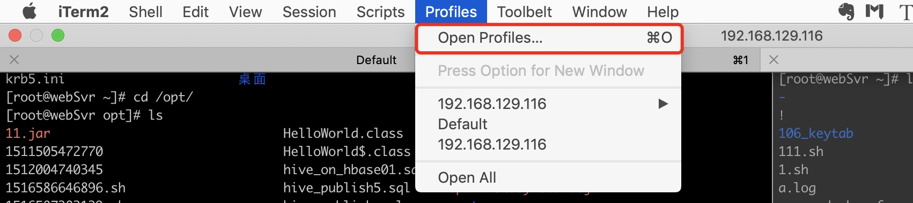
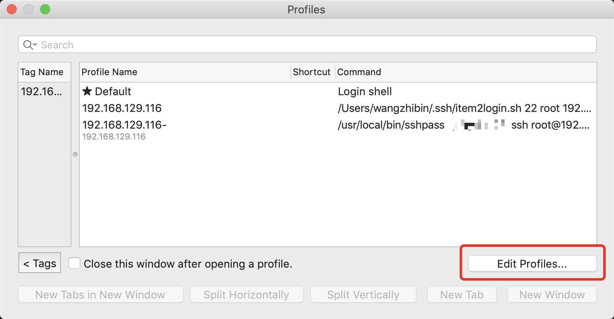
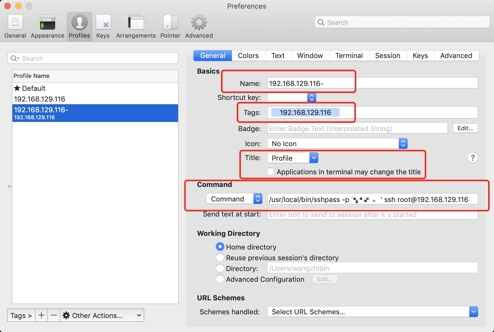
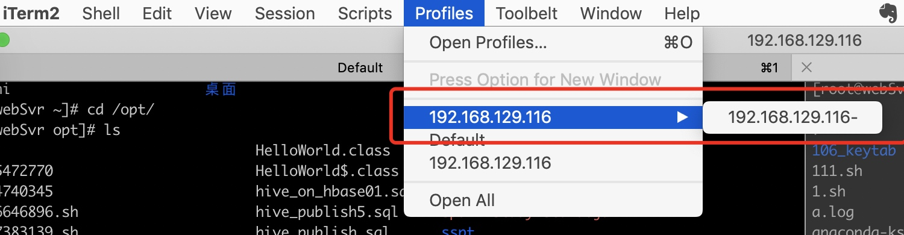

# 2019-05-13 | iTerm2快速SSH连接并保存密码

> 2019-05-15 发布博客。

## 背景

Mac自带terminal，以及比较好用的iTerm2命令行工具，都缺乏一个功能，就是远程SSH连接，无法保存密码。
一种方法是将本机的ssh_key放到远程服务器中实现无密码登录。这种方法在很多情况下无法实现，因为远程服务器大多是客户的。
本文介绍一个简单、轻量级的命令行工具——sshpass，通过它我们能够向命令提示符本身提供密码（非交互式密码验证），这样就可以实现自动连接远程服务器，而且能自动执行远程命令。

## 安装sshpass

1. 下载sshpass：https://sourceforge.net/projects/sshpass/files/
2. 进入 sshpass目录
3. 运行【./configure】
4. 运行【sudo make install】
5. 运行【sshpass 】 来测试是否安装成功

## sshpass使用
```
Usage: sshpass [-f|-d|-p|-e] [-hV] command parameters
-f filename   Take password to use from file
-d number     Use number as file descriptor for getting password
-p password   Provide password as argument (security unwise)
-e            Password is passed as env-var "SSHPASS"
With no parameters - password will be taken from stdin
-h            Show help (this screen)
-V            Print version information
At most one of -f, -d, -p or -e should be used
```

使用用户名和密码登录到远程Linux ssh服务器（10.42.0.1），并检查文件系统磁盘使用情况，如图所示。
```
$ sshpass -p 'my_pass_here' ssh aaronkilik@10.42.0.1 'df -h' 
```


也可以使用sshpass 通过scp传输文件或者rsync备份/同步文件，如下所示：
```
------- Transfer Files Using SCP ------- 
$ scp -r /var/www/html/example.com --rsh="sshpass -p 'my_pass_here' ssh -l aaronkilik" 10.42.0.1:/var/www/html
------- Backup or Sync Files Using Rsync -------
$ rsync --rsh="sshpass -p 'my_pass_here' ssh -l aaronkilik" 10.42.0.1:/data/backup/ /backup/
```

## iTerm2集成sshpass实现快速SSH连接
* 打开iTerm2的Profiles菜单，进入Profiles设置。
    
* 点击Edit Profiles。
    
* 增加SSH连接。
    * Name：名称
    * Tags：分组或者标签名称
    * Title：设置窗口名称
    * Command：`/usr/local/bin/sshpass -p 'xxxx' ssh root@192.168.129.116`
    
* 快速连接
    


## 参考资料
1. [sshpass：一个很棒的免交互SSH登录工具，但不要用在生产服务器上](https://linux.cn/article-8086-1.html)
2. [iTerm2 保存ssh用户名密码](https://www.jianshu.com/p/7a7584dcee2b)