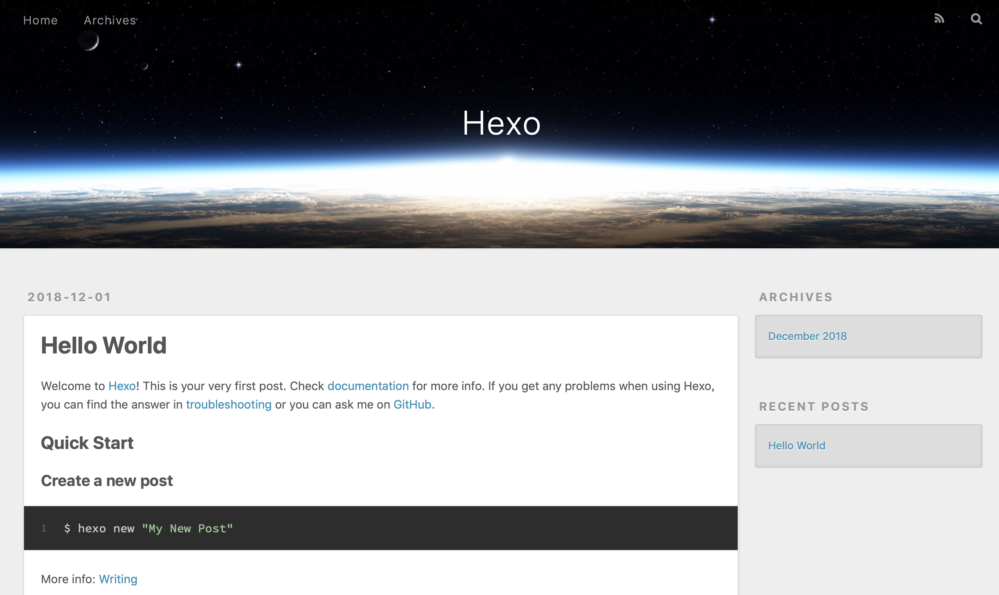

# 使用Hexo+Github搭建静态博客

本文介绍了一种在github中搭建博客的方法。

## 基础环境

* 安装Git，[参考资料](https://git-scm.com/book/zh/v1/%E8%B5%B7%E6%AD%A5-%E5%AE%89%E8%A3%85-Git)
* 安装NodeJS，[官网下载](https://nodejs.org/zh-cn/download/)


## Github配置

### 注册账号

如果没有Github账号，请在[github网站](https://github.com/)注册账号。

### 建立Repository

建立与你用户名对应的仓库，仓库名必须为【your_user_name**.github.io**】

### 配置SSH-Key

在本地生成ssh-key，配置到github中。
参考资料：https://help.github.com/articles/connecting-to-github-with-ssh/

## Hexo安装与配置

### 安装

打开Git命令行，执行如下命令
```
$ npm install -g hexo
```

也可以使用cnpm来安装。

### 初始化博客

建立一个名字叫"hexo"的文件夹（如：/user/xxx/hexo），在user/xxx/hexo执行下面的命令

```
$ hexo init
$ npm install
```

hexo会在这个文件夹下创建初始化博客所需要的文件。新建完成后，指定文件夹的目录如下：

```
.
├── _config.yml
├── package.json
├── scaffolds
├── source
|   ├── _drafts
|   └── _posts
└── themes
```

### 启动本地服务

在/user/xxx/hexo下运行下面的命令

```
$ hexo server
[info] Hexo is running at http://localhost:4000/. Press Ctrl+C to stop.
```

表明Hexo Server已经启动了，在浏览器中打开  http://localhost:4000/ ，这时可以看到Hexo已为你生成了一篇blog。




也可以指定端口号来运行。可以在执行时使用 -p 选项指定其他端口，如下：

```
$ hexo server -p 5000
```

### 新建一篇文章

你可以执行下列命令来创建一篇新文章。

```
$ hexo new [layout] <title>
```

您可以在命令中指定文章的布局（layout），默认为 `post`，可以通过修改 `_config.yml` 中的 `default_layout` 参数来指定默认布局。

### 布局（Layout）

Hexo 有三种默认布局：`post`、`page` 和 `draft`，它们分别对应不同的路径，而您自定义的其他布局和 `post` 相同，都将储存到 `source/_posts` 文件夹。

| 布局    | 路径             |
| ------- | ---------------- |
| `post`  | `source/_posts`  |
| `page`  | `source`         |
| `draft` | `source/_drafts` |

### 文章头部

新建文章后，在/user/xxx/hexo/source/\_posts目录会生成一个markdown文件。默认的文章头部如下：
```
title: <title>
date: 2018-11-30 22:20:42
```
你也可以指定其他头部，如标签`tags`、目录`categories`、布局`layout`等。
```
tags: Hexo, Github
categories: 技术专题
```

### 编辑文章

可以使用一个支持markdown语法的编辑器（比如Typora、Visual Studio Code等）来编辑该文件。

### 生成静态页面

执行下面的命令，将markdown文件生成静态网页。

```
$ hexo generate
```

该命令执行完后，会在 /user/xxx/hexo/public/目录下生成一系列html，css等文件。

### 部署到Github

部署到Github前需要配置_config.yml文件，首先找到下面的内容

```
# Deployment
## Docs: http://hexo.io/docs/deployment.html
deploy:
  type:
```

然后将它们修改为

```
# Deployment
## Docs: http://hexo.io/docs/deployment.html
deploy:
  type: git
  repository: git@github.com:xxx/xxx.github.io.git
  branch: master
```

**注意：**
1. 新版本中这里depoly的type要写成为git（有的type使用github），然后执行：
```
npm install hexo-deployer-git --save
```
再执行下面的部署，否则会出现 error deployer not found:git 的错误。
2. Repository：必须是SSH形式的 url，而不能是HTTPS形式的 url，否则会出现错误：
```
$ hexo deploy
[info] Start deploying: github
[error] https://github.com/xxx/xxx.github.io is not a valid repositor URL!
```
### 部署完成

当部署完成后，在浏览器中打开http://xxx.github.io/ ，正常显示网页，表明部署成功。

## Hexo命令总结
比较全的命令汇总：https://www.kancloud.cn/wizardforcel/hexo-doc/101377

```
hexo new "postName" #新建文章
hexo new page "pageName" #新建页面
hexo generate #生成静态页面至public目录
hexo server #开启预览访问端口（默认端口4000，'ctrl + c'关闭server）
hexo deploy #将public目录部署到GitHub
hexo help  #查看帮助
hexo version  #查看Hexo的版本
hexo clean #清除public中的缓存
```
命令简写：
```
hexo n == hexo new
hexo g == hexo generate
hexo s == hexo server
hexo d == hexo deploy
hexo s -g #生成+本地测试
hexo d -g #生成+部署
```
## 安装主题

1. [Maupassant](https://www.haomwei.com/technology/maupassant-hexo.html)

## 其他

1. 评论插件：
  * [GitTalk](https://zhr26818.github.io/2017/12/19/%E4%B8%BA%E5%8D%9A%E5%AE%A2%E6%B7%BB%E5%8A%A0-Gitalk-%E8%AF%84%E8%AE%BA%E6%8F%92%E4%BB%B6/)
1. [文章计数插件](https://www.jianshu.com/p/e122fc6f5946)
2. [百度搜索](https://blog.csdn.net/u010820857/article/details/82086232)


