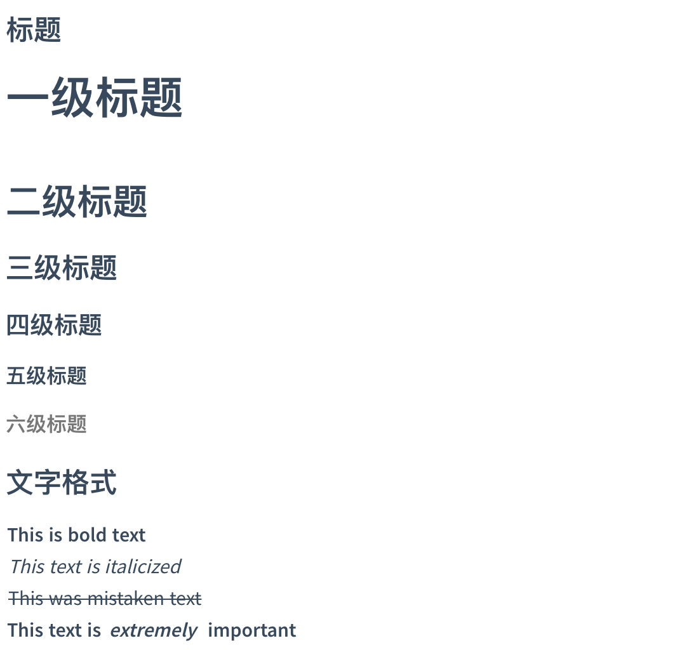

# 初步认识markdown
## 为什么是Markdown
###  文本编辑比较
* 无格式文本：简洁、不依赖工具
* 富文本：美观，重点突出

Markdown与富文本编辑器异同：
* **作用一致：** 使用者输入纯文字，通过编辑器的处理，使其拥有一份样式，最终得到带格式的文档。
* **使用区别：**
    * 富文本编辑器「所见即所得」
    * Markdown是一种标记语言，手动切换预览与编辑模式。
**Markdown同时兼具无格式文本与富文本的优势。**
### 什么是Markdown

> Markdown 是一种轻量级标记语言，它允许人们使用易读易写的纯文本格式编写文档，然后转换成格式丰富的HTML页面。    —— [维基百科](https://zh.wikipedia.org/wiki/Markdown)
Markdown 是一种轻量级的「标记语言」，创始人为约翰·格鲁伯。Markdown 的创始人 John Gruber 这样定义：
"Markdown" is two things:
(1) a plain text formatting syntax;
(2) a software tool, that converts the plain text formatting to others.
也就是说Markdown首先意味着是一套语法规则，其次代表了编辑器，把纯文本转换为排版效果的文字。
### Markdown语法演进
* CommonMark
* GFM(GitHub Flavored Markdown)
* 其他语法：[PHP Markdown Extra](https://michelf.ca/projects/php-markdown/extra/)、[Maruku](https://github.com/bhollis/maruku/blob/master/docs/markdown_syntax.md)、[kramdown](http://kramdown.gettalong.org/)、[RDiscount](http://www.pell.portland.or.us/~orc/Code/discount/)、[Redcarpet](https://github.com/vmg/redcarpet)、**[MultiMarkdown](http://fletcherpenney.net/)**
原有的 Markdown 语法的功能稍显不足，Github Flavored Markdown 在前面所说的语法的三个方面都做出了相应的增强。
比如：
* 标准Markdown要在一行的最后加两个空格符才表示换行，否则是不换行的；但是GFM则没有此要求。
* 支持把列表变成带勾选框的任务列表
* 在对段落的处理方面，对原有代码块进行了增强，可以制定不同的语言类型对代码进行语法高亮。
GFM的修改参考：http://www.franktly.com/2016/01/22/GFM%E6%A0%BC%E5%BC%8FMarkdown%E7%AE%80%E4%BB%8B/
GFM语法参考：https://help.github.com/articles/basic-writing-and-formatting-syntax/#styling-text
* 语法特点：
  * 用简洁的语法代替排版，其常用的标记符号不超过十个，
  * 相对于更为复杂的 HTML 标记语言来说，Markdown 十分的轻量
  * 一旦熟悉这种语法规则，会有沉浸式编辑的效果。
* 其他增强型Markdown语法：MultiMarkdown （http://fletcherpenney.net/）
### Markdown优势
* 书写过程流畅
富文本编辑器编辑文字时是两个不连续的动作，输入文字时双手放在键盘上，编辑文字则需要视线和手离开输入框和键盘，去寻找和点击功能按钮。
Markdown 的「书写流畅」就体现在将这两个动作合成一个输入字符的动作。
* 格式不随编辑器而改变，导出与分享方便
Markdown 格式保持的文件本质上仍是一份纯文本。
* 书写错误容易发现。
比如Word中，用空格、分页来控制排版，容易出错。而Markdown没有不需要考虑几个空格的问题，如果有几个词语想加粗，没有渲染成功，就说明写错了。
### Markdown 的局限性
什么时候不该用 Markdown？
* Markdown 无法对「段落」进行灵活处理。比如：文本位置
* Markdown 对非纯文本元素的排版能力很差。比如：图文混排
**Markdown一开始就定位为「文字输入工具」，不适合对排版格式自定义程度较高的文档进行排版。**

### Markdown适用场景：
* 网络环境下的写作
利用了 Markdown 「写作即排版」的特点，Markdown 可以让使用者专心于文章书写，而非排版。
* 文档协作
    * 团队成员间可以自由选用自己喜欢的操作系统和编辑器工具来进行写作，而不局限于 Word 或者 Google Docs等只支持富文本编辑的软件。
    * 文档的展示方式不仅仅是在编辑器中，你可以随时把文档转换成网页，任何时候任何人都可以方便地查看。
利用它「纯文本格式」的优势，用 Markdown 来文档协作会比其他工具更自由。

## 基础语法

### 标题



markdown代码：
```
# 一级标题
## 二级标题
### 三级标题
#### 四级标题
##### 五级标题
###### 六级标题
### 文字格式
**This is bold text**
*This text is italicized*
~~This was mistaken text~~
**This text is _extremely_ important**
```


### 区块引用

#### 尼采说：

> Was mich nicht umbringt, macht mich **stärker**.

markdown代码：
```
#### 尼采说：

> Was mich nicht umbringt, macht mich **stärker**.
```

### 列表

#### 无序列表

- George Washington
- John Adams
- Thomas Jefferson
* George Washington
* John Adams
* Thomas Jefferson

#### 有序列表
1. James Madison
2. James Monroe
3. John Quincy Adams
#### 嵌套列表
1. First list item
   - First nested list item
     - Second nested list item


markdown代码：
```
#### 无序列表

- George Washington
- John Adams
- Thomas Jefferson
* George Washington
* John Adams
* Thomas Jefferson

#### 有序列表
1. James Madison
2. James Monroe
3. John Quincy Adams
#### 嵌套列表
1. First list item
   - First nested list item
     - Second nested list item

```
### 代码

#### 行内代码
Use `git status` to list all new or modified files that haven't yet been committed.
#### 代码块
```python
@requires_authorization
def somefunc(param1='', param2=0):
    '''A docstring'''
    if param1 > param2: # interesting
        print 'Greater'
    return (param2 - param1 + 1) or None
class SomeClass:
    pass
>>> message = '''interpreter
... prompt'''
```

markdown代码：
```
#### 行内代码
Use `git status` to list all new or modified files that haven't yet been committed.
#### 代码块
​```python
@requires_authorization
def somefunc(param1='', param2=0):
    '''A docstring'''
    if param1 > param2: # interesting
        print 'Greater'
    return (param2 - param1 + 1) or None
class SomeClass:
    pass
>>> message = '''interpreter
... prompt'''
​```
```
### 分割线

这是分割线

---

这也是分割线

***
markdown代码：
```
这是分割线

---

这也是分割线

***
```

### 链接

#### 网络链接
This site was built using [GitHub Pages](https://pages.github.com/).
This site was built using [GitHub Pages][1].

#### 相对链接
[Test.md](./test.md)
#### 图片链接


markdown代码：
```
#### 网络链接
This site was built using [GitHub Pages](https://pages.github.com/).
This site was built using [GitHub Pages][1].

#### 相对链接
[Test.md](./test.md)
#### 图片链接


```


#### 脚注

脚注[^demo]
参考[^1]
markdown代码：

```
脚注[^demo]
参考[^1]
```

## 高级语法
#### 表格
| Item     |    Value | Qty  |
| :------- | -------: | :--: |
| Computer | 1600 USD |  5   |
| Phone    |   12 USD |  12  |
| Pipe     |    1 USD | 234  |

markdown代码：
```
#### 表格
| Item     |    Value | Qty  |
| :------- | -------: | :--: |
| Computer | 1600 USD |  5   |
| Phone    |   12 USD |  12  |
| Pipe     |    1 USD | 234  |
```
#### 目录
[TOC]
markdown代码：
```
#### 目录
[TOC]
```

#### 待办事项
使用 `- [ ]` 和 `- [x]` 语法可以创建复选框，实现 todo-list 等功能。例如：
- [x] 已完成事项
- [ ] 待办事项1
- [ ] 待办事项2


markdown代码：
```

#### 待办事项
使用 `- [ ]` 和 `- [x]` 语法可以创建复选框，实现 todo-list 等功能。例如：
- [x] 已完成事项
- [ ] 待办事项1
- [ ] 待办事项2
```
#### 公式
$$E=mc^2$$

可以创建行内公式，例如 $\Gamma(n) = (n-1)!\quad\forall n\in\mathbb N$。或者块级公式：

$$x = \dfrac{-b \pm \sqrt{b^2 - 4ac}}{2a} $$


markdown代码：

```
#### 公式
$$E=mc^2$$
可以创建行内公式，例如 $\Gamma(n) = (n-1)!\quad\forall n\in\mathbb N$。或者块级公式：
$$x = \dfrac{-b \pm \sqrt{b^2 - 4ac}}{2a} $$
```

#### 流程图
```flow
st=>start: Start
op=>operation: Your Operation
cond=>condition: Yes or No?
e=>end
st->op->cond
cond(yes)->e
cond(no)->op
```
markdown代码：
```

#### 流程图
​```flow
st=>start: Start
op=>operation: Your Operation
cond=>condition: Yes or No?
e=>end
st->op->cond
cond(yes)->e
cond(no)->op
​```
```


#### 序列图
```sequence
Alice->Bob: Hello Bob, how are you?
Note right of Bob: Bob thinks
Bob-->Alice: I am good thanks!
```
markdown代码：
```
#### 序列图
​```sequence
Alice->Bob: Hello Bob, how are you?
Note right of Bob: Bob thinks
Bob-->Alice: I am good thanks!
​```
```


## 工具推荐
* Typora
    * 特点：
        * WYSIWYG（What You See Is What You Get）
        * 表格编辑功能增强
        * 插入图片
        * 代码和数学公式输入
        * 支持显示目录大纲
    * 下载：https://www.typora.io/
    * 介绍：https://sspai.com/post/30292
* Atom
* 有道云笔记
* 印象笔记（markdown功能正在路上）
* 小书匠

## 参考资料
* 印象笔记 Markdown 入门指南：https://list.yinxiang.com/markdown/eef42447-db3f-48ee-827b-1bb34c03eb83.php
* Markdown 完全入门（上）：https://sspai.com/post/36610
* Markdown 完全入门（下）：https://sspai.com/post/36682
* Markdown教程：http://www.markdown.cn/
* 创始人 John Gruber 的 Markdown 语法说明：https://daringfireball.net/projects/markdown/syntax
* Github Flavored Markdown语法：https://help.github.com/articles/basic-writing-and-formatting-syntax/ 
* 印象笔记 Markdown 入门指南：https://list.yinxiang.com/markdown/eef42447-db3f-48ee-827b-1bb34c03eb83.php 
* Markdown简易入门教程：https://blog.huihut.com/2017/01/25/MarkdownTutorial/ 
* Typora介绍：https://sspai.com/post/30292


[^demo]: 这是一个脚注。

[^1]: 这也是一个脚注。
[1]:https://pages.github.com/
