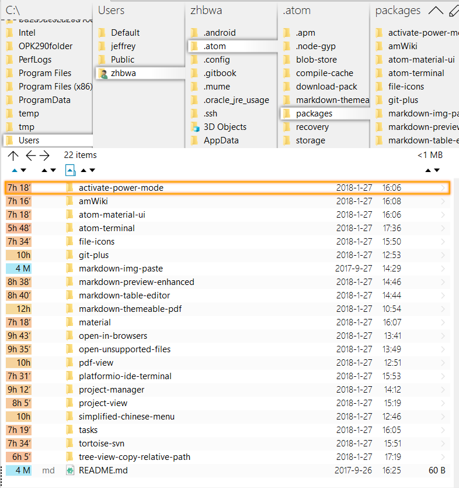
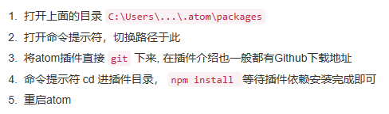
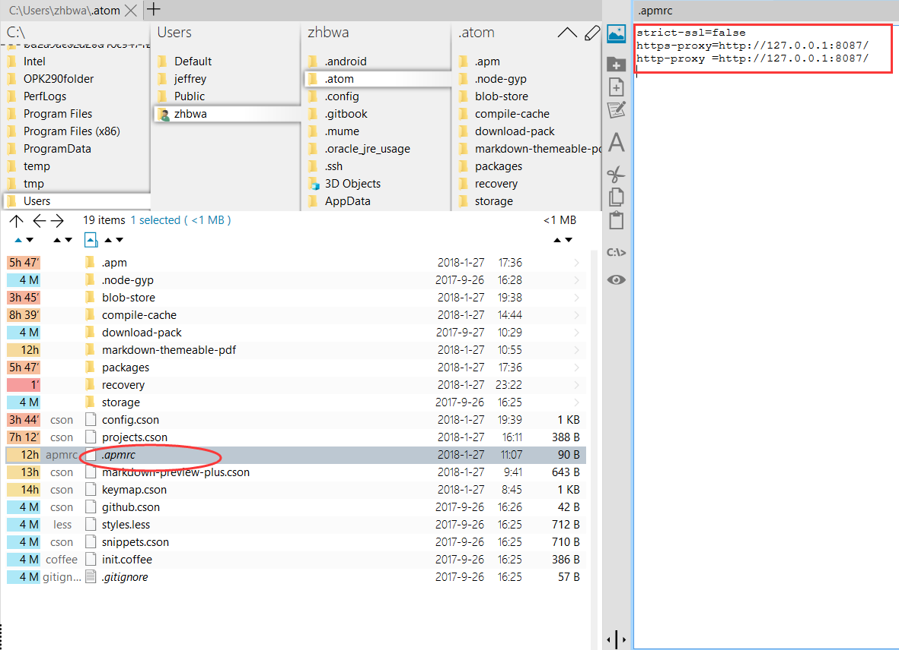

# 软件 | Atom必备插件、主题与使用经验

> 2018-01-27 

## 插件篇
我最常用的包：

参考：https://www.jianshu.com/p/eac1879cb2e9
1. simplified-chinese-menu
  Atom 的简体中文汉化语言包,目前最全的汉化包。包含菜单汉化、右键菜单汉化以及设置汉化
2. atom-beautify
  代码格式一键美化，支持多种语言格式化，例如：HTML, CSS, JavaScript, PHP, Python, Ruby, Java, C, C++, C#, Objective-C, CoffeeScript, TypeScript, Coldfusion, SQL …
3. last-cursor-position
  光标自由切换到上一次/下一次编辑位置
4. minimap
  仿sublime text的缩略代码查看，想找的地方一目了然。
5. minimap-highlight-selected
  实现minimap高亮选择内容，需安装前2个插件
6. activate-power-mode
  屏振效果,打字带特效,输入时有震撼效果
7. color-picker
  取色工具,在编辑器里面挑选颜色
8. pigments
  颜色显示插件,编辑器中直接查看代码所代表的颜色，工具虽小但是很实用。
9. highlight-selected
  选择某段代码自动高亮相同代码
10. emmet
  HTML开发必备神奇，大大提高你的工作效率
  加快web开发速度，提供snippet(代码片段)、abbreviation expand(简写展开)功能。
11. docblockr
   智能代码注释，让注释更有规范
12. project-manager
   快速打开储存的项目
13. autocomplete-paths
   自动补全文件路径
14. atom-react-native-autocomplete
   react-native代码补全插件
15. merge-conflicts
   在 Atom 里面处理合并产生冲突的文件
16. script
   在atom下运行脚本，支持多种开发语言。
17. browser-plus
   编辑器内置浏览器
18. ask-stack
   在atom快速提问stackoverflow
19. regex-railroad-diagram
   正则表达式图形化
20. advanced-open-file
   快速的打开文件或新建文件，同时支持路径补全
21. quick-highlight
   代码高亮
22. platformio-ide-terminal
   终端工具
23. open-in-browsers
   在安装过的任意浏览器打开代码
24. linter/ linter-eslint
   代码错误提示，需要配合相应的规则插件进行使用，例如：linter-eslint(根据eslint规则进行js代码检验，需要安装linter插件)
25. autocomplete-paths
   填写路径的时候有提示
26. hyperclick / js-hyperclick
   这个两个插件配合使用，可以实现类似于IDE的Ctrl+click，跳转到变量函数声明或者定义的地方。
27. Sublime-Style-Column-Selection
   局部选择插件
28. file-icons
   左侧树状图下，根据文件类型左侧显示不同图标
29. tool-bar
   工具栏插件，需要配合其他插件
30. flex-tool-bar
   配合工具栏插件，自定义图标与事件
31. atom-terminal-panel
   atom内置命令行工具
32. language-javascript-jsx/language-babel
   代码高亮，支持ES6,ES7, React JSX…
33. es6-javascript
   ES6代码快捷键
34. react-snippets
   react代码快捷键
35. atom-bootstrap3
   bootstrap3 html自动补全插件
36. sync-settings
   备份插件和配置备份，防止系统重装后需要重新查找插件，直接自动下载插件并且配置好atom
37. atom-ternjs
   支持多种语言代码补全，例如：ES5, ES6 (JavaScript 2015), Node.js, jQuery, Angular …
38. vim-mode
   有了 vim-mode 一定要装ex-mode和relative-numbers插件，前者让编辑器完美支持:w:s等命令；后者可以实现常规模式下的相对行号，用 vim 的自然会懂得其重要性。
39. terminal-plus
   cmd+shift+t开启新控制台
   ctrl+`打开 /关闭 控制台
40. tortoise-svn
   svn插件
41. Git/github
   git-plus—在 Atom 里面执行Git命令，不用来回切换终端和编辑器
   git-control—git面板
   tree-view-git-status—文件夹git状态
   gist-it—快速分享代码到gist.github.com
   git-log图形化git提交记录

参考：https://www.cnblogs.com/wteng/p/6432241.html
1. Emmet：
  他的前身是大名鼎鼎的Zen coding，可以快速生成代码，提高编码速度

2. autoprefixer：
  css前缀自动补全，超级方便有没有

3. csscomb：
  使用这个工具可以帮助你重新排列CSS中定义的属性，帮助你按照你预定义的排序格式生成新的CSS 戳这了解更多 （小伙伴也可以自行百度）

4. open-in-browser/open-in-browser：
  右键左侧菜单让html在浏览器中打开，不用再去文件里双击啦~

5. atom-ternjs：
  该插件能对一个对象中拥有的对外提供的属性和方法都能通过suggest的形式提示出来，能对一个对象对外提供的接口有一个选择过程，可以理解为js代码自动提示。

6. atom-html-preview
  atom 代码编辑实时预览html页面

7. docblockr
  智能代码注释，让注释更有规范

8. js-hyperclick
  js变量、方法点击跳转，（备注：还需要安装 hyperclick 插件）

9. 打造MarkDown编辑器
https://www.cnblogs.com/libin-1/p/6638165.html

## 二、主题篇

1. monokai(主题)

## 三、使用篇

1. 插件安装不成功，可以有两个方法解决
  下载离线包，放在C:\Users\...\.atom\packages文件夹里面。

  

2. 修改网络代理，使用翻墙代理：

  

## 四、快捷键篇

1. alt+shift+P  打开项目管理
2. ctrl+t/p     当前项目查找文件
3. ctrl+alt+o  快速打开文件，新建文件
4. ctrl+shift+\ 快速定位文件目录
5. ctrl+\     显示\隐藏文件目录树
6. 目录树下，使用a，m，delete来增加，修改和删除
7. cmd-b 在打开的文件之间切换

