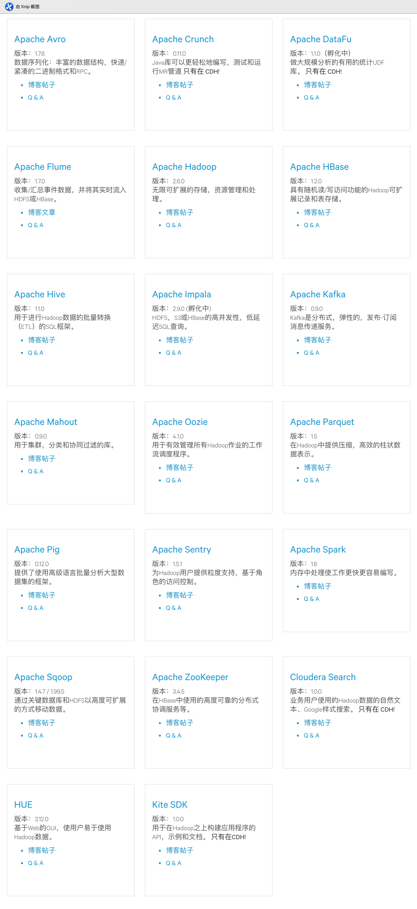

# Hadoop发行版本

## Hadoop发行版本种类

- DKhadoop发行版
- cloudera发行版（CDH）
- hortonworks发行版
- MAPR发行版
- 华为hadoop发行版

重点：
1. 由于在本地系统上，只需10分钟左右就可完成其独立安装，所以Apache Hadoop很适合于第一次尝试。你可以试试WordCount示例(这是Hadoop的“hello world”示例)，并浏览部分MapReduce的Java代码 。
2. 对于真正的Hadoop项目来说，我强烈推荐使用一个Hadoop的发行版本来代替Apache Hadoop。
3. Hadoop发行版本解决了在上一节中所提到的问题。发行版本提供商的商业模型百分之百地依赖于自己的发行版本。他们提供打包、工具和商业支持。而这些不仅极大地简化了开发，而且也极大地简化了操作。
4. Hadoop 发行版本提供商
    目前，除了 Apache Hadoop 外， HortonWorks、Cloudera 和 MapR 三驾马车在发布版本上差不多齐头并进。虽然，在此期间也出现了其他的 Hadoop 发行版本。比如 EMC 公司的 Pivotal HD、IBM 的 InfoSphere BigInsights。通过 Amazon Elastic MapReduce（EMR），Amazon 甚至在其云上提供了一个托管的、预配置的解决方案。
    

参考资料：
1. https://www.infoq.cn/article/BigDataPlatform
2. https://blog.51cto.com/ixdba/1869043
3. https://blog.csdn.net/u011594486/article/details/77507738
4. https://www.jianshu.com/p/006d8a4b85b0

## CDH版本
1. 2019-05-15 | 当前生产版本：5.12.x
2. https://cn.cloudera.com/developers/inside-cdh.html

    
## 测试环境
106-109   cm在106上http://192.168.129.106:7180/cmf/home  admin/tydic123

## 安装文档
1. http://www.ityouknow.com/hadoop/2017/07/24/hadoop-cluster-setup.html
2. https://www.linuxidc.com/Linux/2015-03/114669p4.htm
3. http://bigdata.51cto.com/art/201712/560374.htm

## docker安装hadoop
https://github.com/kiwenlau/hadoop-cluster-docker