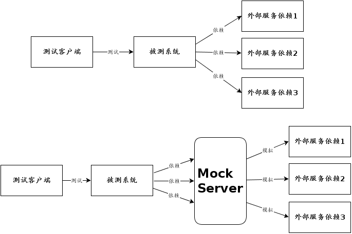

# 接口测试
## 什么是接口测试
接口测试是测试系统组件间接口的一种测试。接口测试主要用于检测外部系统与系统之间以及内部各个子系统之间的交互点。测试的重点是要检查数据的交换，传递和控制管理过程，以及系统间的相互逻辑依赖关系等。

## 主流接口测试框架
### 需求
1、接口编写方便。
2、方便调试接口。
3、支持数据初始化。
4、生成测试报告。
5、支持参数化。

### 测试框架
1. JMeter：适用于性能测试，做接口的功能，创建接口的效率较低。
2. HttpRunner：基于YAML/JSON格式，专注于接口本身的编写，能生成测试报告。接口本身的编写比较复杂。
3. gauge：BDD行为驱动测试框架。行为文件与脚本文件分离
4. Unittest+Request+HTMLRunner：足够灵活强大，分层测试、数据驱动、测试报告，集成CI

## 如何在没有文档的情况下测试后台接口
1. 使用抓包工具对服务器的TCP包或者HTTP包进行抓取，解析数据，自动生成接口文档
2. 开发接口测试工具，自动实现通过接口文档进行测试，并生成测试报告。
3. 问题在于：如何保证通过抓包工具抓取的数据是功能正确的？

## 接口测试中的问题
1. 依赖的其他接口改变了，造成测试不通过的问题。
    背景：现今的业务系统很少有孤立存在的，它们或多或少需要使用兄弟团队或是其他公司提供的服务，这给我们的联调和测试造成了麻烦。对于这种情况，我们常见的解决方案是搭建一个临时的server，模拟那些服务，提供数据进行联调和测试。这就是 mock server 出现原因。
    解决：使用现成的 Mock Server 库创建系统。
    1. https://github.com/jamesdbloom/mockserver
    2. https://github.com/dreamhead/moco
    
2. 请问requests.session怎么保存cookie能够在下一次请求中自动获取cookie呢？
    回答：可以使用【正则表达式提取器】。

参考资料：
1. [主流接口测试框架对比](https://www.cnblogs.com/fnng/p/9919803.html)